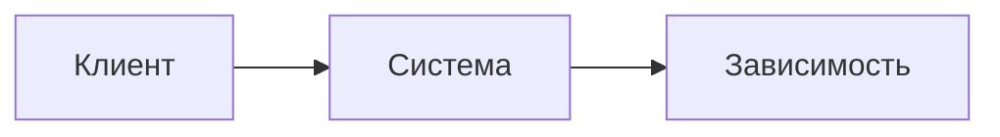

# Высокоуровневое описание архитектуры

## Обзор текущей архитектуры

<краткое описание текущего решения>

- Тип утверждения: `наблюдаемый факт | выведено косвенно | требует подтверждения`
- Источники:
  - `<repo-name/path/to/entrypoint-or-composition-root>`
  - `<repo-name/path/to/config-or-contract>`

## Контекстная диаграмма

## Компоненты

### <название компонента>

- зона ответственности
- подтверждающие артефакты
- тип утверждения: `наблюдаемый факт | выведено косвенно | требует подтверждения`
- источники:
  - `<repo-name/path/to/component>`

## Основные потоки

1. <основной поток>

## Интеграции

1. <краткое описание интеграции>

## Риски и пробелы

1. <риск или пробел в документации>

## Примечания по достоверности

- <что подтверждено, а что выведено косвенно>

## Трассировка источников по разделам

| Раздел | Тип утверждения | Источники |
| --- | --- | --- |
| `Обзор текущей архитектуры` | `наблюдаемый факт \| выведено косвенно \| требует подтверждения` | `<repo-name/path>` |
| `Компоненты` | `наблюдаемый факт \| выведено косвенно \| требует подтверждения` | `<repo-name/path>` |
| `Основные потоки` | `наблюдаемый факт \| выведено косвенно \| требует подтверждения` | `<repo-name/path>` |
| `Интеграции` | `наблюдаемый факт \| выведено косвенно \| требует подтверждения` | `<repo-name/path>` |
| `Риски и пробелы` | `наблюдаемый факт \| выведено косвенно \| требует подтверждения` | `<repo-name/path>` |
