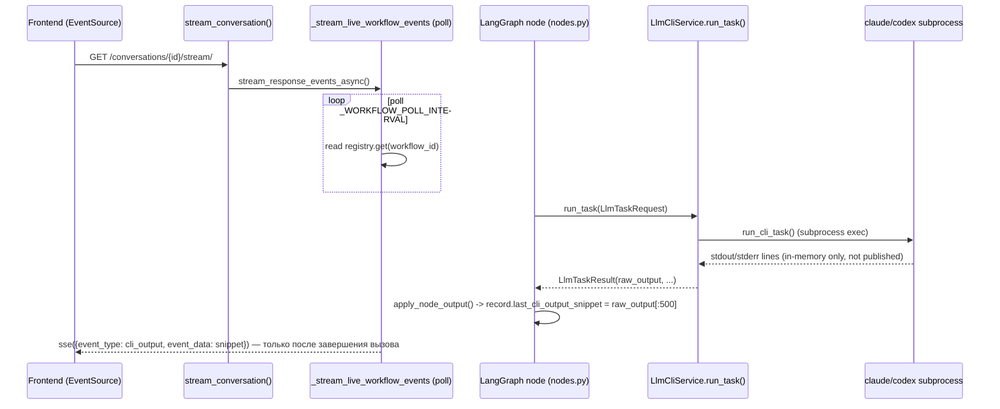

# Realtime Workflow Observability (init_arch SSE)

## Проблема

Сейчас пользователь на `InitWorkflowPage` видит через SSE только часть происходящего, и без разметки
"кто говорит" — workflow (детерминированный backend-код) или LLM-агент (`claude`/`codex` CLI внутри
контейнера). Разбор источников:

- **`init_arch` (граф-воркфлоу, основной сценарий)** — [`_stream_live_workflow_events()`](../../back/app/services/init_arch_workflow.py#L645-L684)
  поллит только `current.current_step_id`/`current.last_cli_output_snippet` каждые `_WORKFLOW_POLL_INTERVAL`.
  Это значит:
  - `step_started` приходит по факту смены шага — без человекочитаемого названия шага и без объяснения, что
    на нём вообще происходит;
  - `cli_output` — это не live-поток, а **обрезанный до 500 символов финальный `raw_output`** LLM-вызова
    (`node_output["last_cli_output"]`, [nodes.py:65](../../back/app/workflows/init_arch/nodes.py#L65)),
    появляющийся только после того как LLM-вызов уже завершился — то есть пока `claude`/`codex` реально
    работает (может быть 1-10+ минут на шаг), пользователь не видит вообще ничего нового;
  - сам текст промпта, отправленного в LLM (`LlmTaskRequest.prompt_text`), нигде в SSE не публикуется — он
    есть только в аудит-событии `LLM_TASK_REQUESTED`, и даже там не входит в payload
    ([task_runner.py:291-297](../../back/app/services/task_runner.py#L291-L297) кладёт только
    `llm_call_id`/`engine_name`/`expected_schema`);
  - нет разметки "это сказал workflow" vs "это ответ/вывод LLM" — фронт получает плоский `event_type` без
    поля `actor`.
- **`update_arch`/`query` (одиночная CLI-задача без графа)** — [`_stream_task_events()`](../../back/app/services/init_arch_workflow.py#L687-L714)
  устроен принципиально иначе: реально почти в реальном времени шлёт построчный `stdout`/`stderr` CLI-процесса
  (`output`/`progress`), потому что `task_runner.py` пишет строки в `CliTask.stdout_lines`/`stderr_lines` по
  мере поступления ([task_runner.py:168-173](../../back/app/services/task_runner.py#L168-L173)), а генератор
  их поллит. Но и здесь: (а) это сырой текст CLI (`--output-format stream-json`/`--json`), который фронт не
  парсит и просто печатает как есть — assistant-сообщения, tool_use-вызовы и system-события сливаются в одну
  простыню; (б) сам промпт тоже не публикуется.
- **Persisted replay** (`_stream_persisted_workflow_events()`,
  [init_arch_workflow.py:615-643](../../back/app/services/init_arch_workflow.py#L615-L643)) технически **уже**
  отдаёт все `conversation_items`, включая `llm_task_requested/completed/failed` (см.
  [init-arch-execution-dialog-and-transport.md](init-arch-execution-dialog-and-transport.md)) — но только
  после того, как процесс перезапущен/страница переоткрыта; во время live-стриминга этот путь не используется,
  и сами LLM_TASK_* payload'ы всё равно не содержат текста промпта или полного результата — только счётчики
  (`created_artifacts`, `open_questions` — количество, не содержимое).

Итог: пока идёт `init_arch`, пользователь видит редкие "шаг сменился" + один короткий (≤500 символов) кусок
текста после каждого LLM-вызова, без указания, откуда этот текст (LLM-ответ vs служебное сообщение workflow),
без промпта, без структурированного вывода tool-calls, без явной метаинформации "репозиторий X, чеклист-пункт
Y из Z".

## Цель

Пользователь на `InitWorkflowPage` должен в реальном времени видеть:

1. **Что делает workflow** — человекочитаемое название текущего шага, репозиторий/домен/чеклист-пункт, на
   котором он сейчас находится, без необходимости смотреть в код.
2. **Что уходит в LLM** — текст промпта (masked/truncated по тем же правилам, что уже применяются к
   `cli_tasks.prompt_text`), какой движок (`claude`/`codex`), какая задача (`task_kind`).
3. **Что LLM делает по мере работы** — структурированный live-поток из `stream-json`/`--json` вывода CLI:
   tool-calls (какой инструмент, какие аргументы), промежуточные assistant-сообщения — а не сырую JSON-простыню.
4. **Что LLM вернул в итоге** — полный (masked/truncated) `raw_output`, а не 500-символьный обрезок, плюс
   разобранная структура (`completed_actions`, `created_artifacts`, `open_questions_found`).
5. **Явную разметку источника** каждой записи — `actor: "workflow" | "llm" | "user"` — чтобы фронт мог красить
   их по-разному (например, лог workflow серым, LLM-диалог — отдельным цветом).
6. **Возможность остановить прогон и продолжить именно с того шага, на котором он был остановлен** — не
   только пассивно наблюдать, но и управлять long-running workflow (шаги могут занимать часы на больших
   продуктах): поставить на паузу, уйти, вернуться позже и продолжить без потери уже пройденных
   репозиториев/пунктов чеклиста. См. отдельный раздел «Пауза и продолжение» ниже.

Не цель этой спеки: менять транспорт (остаётся SSE), пересматривать граф `init_arch`, добавлять
resume/replay поверх WebSocket. Не цель — доставать chain-of-thought/extended-thinking: `claude -p`/`codex exec`
в headless-режиме такое не печатают, показывать нечего (см. предыдущий разбор в этом диалоге).

## Текущая архитектура (для контекста)

Ключевая проблема — **нет канала, по которому события двигались бы наружу в момент их появления**: и
`_drive_graph_stream()`, и `run_cli_task()` пишут в объекты состояния (`WorkflowRecord`, `CliTask`), а
`_stream_live_workflow_events()` их поллит грубыми срезами. `_stream_task_events()` для `update_arch`/`query`
уже поллит `CliTask.stdout_lines` построчно — тот же примитив нужно завести и для graph-based `init_arch`, но
с более богатым и размеченным payload'ом, а не сырыми строками.

## Предлагаемый дизайн

### 1. Единый event bus per-workflow вместо разрозненного поллинга

**Статус: ✅ реализовано.**

Завести `WorkflowEventBus` (in-memory `asyncio.Queue` per `workflow_id`, живёт в `AgentPool`/registry-подобном
сервисе, аналогично `TaskRegistry`/`WorkflowRegistry`) с методом `publish(workflow_id, event: dict)`.
Источники publish:

- `_drive_graph_stream()` в момент `apply_node_output()`/`apply_interrupt()` — как и сейчас, но публикует
  сразу, а не через отдельный поллинг-цикл SSE-generator'а;
- `run_cli_task()` в `task_runner.py` — на каждой новой строке `stdout`/`stderr` (в `_drain_stream`), если у
  `CliTask` заполнен `workflow_id` (у init_arch-шагов он всегда есть, см.
  [init-graph-reference.md → общий паттерн «В базе»](../workflows/init-graph-reference.md#общий-паттерн-для-в-базе-одинаков-для-всех-16-нод-кроме-отмеченного-отдельно));
- `LlmCliService.run_task()` в `task_runner.py` — в момент `_record_event(LLM_TASK_REQUESTED/COMPLETED/FAILED)`,
  публикует то же событие в bus параллельно с записью в audit.

`_stream_live_workflow_events()` переписывается на `async for event in bus.subscribe(workflow_id): yield _sse(event)`
вместо `while True: ... sleep(poll_interval)`. Экономит и задержку (сейчас до `_WORKFLOW_POLL_INTERVAL` секунд
лага), и убирает нужду в отдельной ветке для "успел проскочить между поллами" стейта.

Реконнект (уже поддержан `useEventSource`, [use-event-source.ts](../../front/src/shared/sse/use-event-source.ts))
после разрыва должен сначала отдать snapshot через существующий `_stream_persisted_workflow_events()` (replay
из `conversation_items`), а затем переключиться на live bus — программа подписки не меняется, меняется только
то, что оба пути (persisted-replay и live-bus) публикуют события одной и той же новой схемы (см. ниже), так что
фронту не нужно знать, откуда пришло событие.

> **Мини-отчёт.** Реализовано как `app/services/workflow_event_bus.py` — `WorkflowEventBus` с
> `publish()`/`subscribe()`/`unsubscribe()` поверх `dict[str, list[asyncio.Queue]]` (без внешних зависимостей,
> in-process synchronous pub/sub — как и `TaskRegistry`/`WorkflowRegistry` рядом). Издатели: `LlmCliService.run_task()`
> в `task_runner.py` (см. §2). Публикация из `_drive_graph_stream()`/`run_cli_task()`-построчного stdout **не**
> реализована в этой фазе — вместо полной замены поллинга `_stream_live_workflow_events()` был сделан гибридный
> вариант с меньшим блast radius: существующий poll-loop (шаг/snippet/terminal-статус, как было) остался почти
> без изменений, но на каждой итерации сначала нативно дренится bus (`_drain_bus_events()`), а ожидание между
> итерациями (`_WORKFLOW_POLL_INTERVAL`) заменено на `asyncio.wait_for(subscription.get(), timeout=...)` — то
> есть bus-события (`llm_call_started/completed/failed`) доставляются мгновенно, а не с лагом до 200мс, но сам
> механизм обнаружения смены шага/статуса не переписан на чистый event-driven — риск для уже отлаженной retry/
> interrupt-логики графа сочтён неоправданным относительно выигрыша. Построчная публикация `stdout`/`stderr` —
> это §3 (live-классификатор), не реализовано в этой фазе.
> Тесты: `tests/services/test_workflow_event_bus.py` (publish/subscribe/unsubscribe/fan-out/no-op на пустой
> workflow_id), `tests/services/test_init_arch_workflow.py::test_stream_live_workflow_events_forwards_bus_events_before_terminal`
> (сквозной тест: снимок текущего шага → bus-событие форвардится до того, как достигнут терминальный статус →
> `workflow_done` → subscription корректно снята через `finally`). Полный прогон `pytest` (627 тестов) и
> `ruff check`/`ruff format --check` зелёные.

### 2. Новая схема событий с явным `actor`

**Статус: 🟡 частично реализовано.** `step_started` (актёр + `step_label`), `llm_call_started`/
`llm_call_completed`/`llm_call_failed` (актёр `llm`, masked `prompt_text`/`raw_output`, `error_reason`) —
готовы и публикуются как live через bus, так и persisted через audit trail (см. §5). `llm_tool_call`/
`llm_message` (построчный разбор `stream-json`/`--json`) — **не реализовано**, это отдельная §3.

Каждое SSE-событие получает поле `actor`:

| actor | кто | примеры `event_type` |
|---|---|---|
| `workflow` | детерминированный backend-код (nodes.py, graph.py) | `step_started`, `interrupted`, `workflow_done`, `workflow_failed`, `artifact_written`, `checklist_item_routed` |
| `llm` | вызов `claude`/`codex` CLI | `llm_call_started`, `llm_tool_call`, `llm_message`, `llm_call_completed`, `llm_call_failed` |
| `user` | ответ/действие пользователя (для симметрии в persisted-replay) | `user_answer_recorded` |

Новые/расширенные типы события (все — payload после masking, см. раздел «Безопасность» ниже):

- **`step_started`** (расширяется): добавить `step_label` (человекочитаемое название на русском, статическая
  таблица `StepId -> str` рядом с `STEP_TO_REFERENCE` в `prompts.py`, например
  `"analyze_repositories": "Анализ репозитория"`), `repo_name`, `repo_index`/`repo_total` (если применимо),
  `checklist_item`/`checklist_index`/`checklist_total` (для `analyze_repositories_item`).
- **`llm_call_started`** (новый, заменяет текущий "молчаливый" `LLM_TASK_REQUESTED`): `engine_name`
  (`claude`/`codex`), `task_kind`, `step_id`, `step_label`, `repo_name`, `domain_id`, `prompt_text` (masked +
  truncated тем же лимитом, что и persisted `cli_tasks.prompt_text` — `AUDIT__MAX_PROMPT_CHARS`), `llm_call_id`.
- **`llm_tool_call`** / **`llm_message`** (новые, только для `claude`, у которого `--output-format stream-json`
  даёт структурные события; `codex --json` даёт аналог через `item.completed`/`item.started` — маппится в те
  же два типа) — по одной на каждую распарсенную строку stdout:
  - `claude`: `type: "assistant"` со стоп-словом `tool_use` в `content` → `llm_tool_call` с полями
    `tool_name`, `tool_input` (усечённый JSON); `type: "assistant"` с текстовым `content` → `llm_message` с
    `text`; `type: "system"` (init) можно не публиковать (шум).
  - `codex`: `item.started`/`item.completed` с `item.type == "command_execution"` → `llm_tool_call`
    (`tool_name: "shell"`, `tool_input: item.command`); `item.type == "agent_message"` → `llm_message`.
  - Если строка не парсится как JSON или тип неизвестен — fallback на текущее поведение (`llm_message` с
    сырым текстом), чтобы новый парсер не мог полностью "заглушить" вывод при смене формата CLI.
- **`llm_call_completed`**/**`llm_call_failed`** (расширяет `LLM_TASK_COMPLETED`/`FAILED`): `raw_output`
  (masked + truncated, `AUDIT__MAX_OUTPUT_CHARS`, не 500 символов), `completed_actions`, `created_artifacts`,
  `open_questions_found` (сами тексты, не только count), `notes`; на `failed` — `error_reason`
  (`auth_expired`/`limit_exhausted`/`task_failed`, уже есть в `LlmTaskExecutionError.reason`).

Существующие `interrupted`/`workflow_done`/`workflow_failed`/`workflow_cancelled`/`artifact_written` остаются
как есть, просто получают `actor: "workflow"`.

> **Мини-отчёт (реализованная часть).** `LlmCliService.run_task()` в `task_runner.py` теперь публикует в bus
> `llm_call_started` (до вызова CLI, с masked `prompt_text`), `llm_call_completed` (masked `raw_output` +
> разобранные `completed_actions`/`created_artifacts`/`open_questions_found`/`notes`) и `llm_call_failed`
> (masked `error` + `error_reason` через уже существующий `LlmTaskExecutionError._detect_reason`) — все три с
> `actor: "llm"`, `step_label` (см. §… ниже — таблица `STEP_LABELS_RU` в
> `app/workflows/init_arch/domain/steps.py`), `repo_name`, `domain_id`, `task_kind`. Те же данные (masked
> `prompt_text`/`raw_output`) добавлены и в persisted audit-события `LLM_TASK_REQUESTED/COMPLETED/FAILED` —
> закрывает и часть §5 разом (live и persisted пути теперь несут одинаково богатый payload, не только счётчики).
> Человекочитаемая таблица шагов реализована в `app/workflows/init_arch/domain/steps.py` как
> `STEP_LABELS_RU: dict[str, str]` + `step_label_ru()` (17 записей StepId + отдельно
> `"analyze_repositories_item"`, который является физическим графовым узлом, а не StepId — см.
> init-graph-reference.md, нода 8), экспортирована через `app.workflows.init_arch.domain`.
> Тесты: `tests/services/test_task_runner.py::TestLlmCliService::test_run_task_publishes_live_bus_events_on_success/
> _on_failure/_skips_bus_publish_without_session_id`.

### 3. Парсинг stream-json без завязки на порядок построчного чтения

**Статус: ✅ реализовано.**

Парсер CLI-вывода (`_parse_claude_stream_line`/`_parse_codex_stream_line`) переиспользует уже существующую
логику `_iter_json_lines`/`_extract_claude_result_text`/`_extract_codex_result_text`
([task_runner.py:127-165](../../back/app/services/task_runner.py#L127-L165)) — не переизобретать разбор
`stream-json`/`--json`, а вынести общий JSON-line-parsing в переиспользуемую функцию и добавить рядом
"live"-варианты, которые классифицируют **одну** строку в `llm_tool_call`/`llm_message`/`None` (шум), вместо
того чтобы (как сейчас) агрегировать все строки в конце. Публикуются по мере появления строки в
`_drain_stream()` — без ожидания завершения процесса.

> **Мини-отчёт.** `_drain_stream()` получил опциональный `on_line` callback, вызываемый на каждой декодированной
> строке до её появления в `stdout_lines` (не только в конце, как раньше). Для stdout `run_cli_task()` передаёт
> `on_line=lambda line: _publish_live_stdout_line(cli_task, line)`; stderr остался без классификации (там нет
> структурного stream-json — это либо CLI-диагностика, либо сообщения линкера/рантайма).
> `_classify_live_stream_line(engine_name, raw_line)` — чистая функция без сайд-эффектов (легко тестируется):
> парсит JSON, диспатчит в `_classify_claude_stream_line`/`_classify_codex_stream_line` (по `type: assistant` →
> `tool_use`/`text` блок для claude; `type: item.completed` → `command_execution`/`agent_message`/`reasoning`
> для codex), фильтрует протокольный шум (`system`/`result` для claude уже покрыты `llm_call_completed`;
> `thread.started`/`turn.*` для codex), и — как и требовал дизайн — **не роняет** непонятный формат в тишину:
> невалидный JSON, неизвестный `type`, или незнакомый `engine_name` дают fallback `llm_message` с сырой строкой
> вместо `None`. `_publish_live_stdout_line()` не публикует ничего для CLI-задач без `workflow_id` (обычный
> `update_arch`/`query`-путь остаётся как был — эта функция вообще не проверяется, если `cli_task.workflow_id`
> пуст), и маскирует `text`/`tool_input` через `sanitize_text()` (§4) перед публикацией.
> Тесты: `TestClassifyLiveStreamLine` (11 юнит-тестов на все ветки классификатора: tool_use/text-блоки claude,
> command_execution/agent_message/reasoning/thread.started codex, невалидный JSON, неизвестный `type`,
> неизвестный engine, пустая строка) + два сквозных теста в `TestRunCliTask`
> (`test_publishes_live_llm_tool_call_and_message_for_workflow_bound_task` гоняет реальный `run_cli_task()` с
> мокнутым subprocess и проверяет итоговые bus-события целиком — actor/repo_name/step_label/masking;
> `test_does_not_publish_live_events_for_task_without_workflow_id` — негативный кейс).

### 4. Безопасность: переиспользовать masking, не изобретать новый

**Статус: ✅ реализовано.**

`_mask_sensitive_text()`/`_truncate_text()` из [task_repo.py:14-42](../../back/app/db/task_repo.py#L14-L42)
сейчас применяются только на пути persist в Postgres. Переносим их (без изменения поведения) в
`app/services/text_sanitization.py` (новый модуль без БД-зависимостей) и переиспользуем в двух местах:

- при формировании persisted `cli_tasks` (как сейчас, без изменений в поведении);
- при публикации `prompt_text`/`raw_output`/`llm_message.text`/`llm_tool_call.tool_input` в SSE-события —
  **до** отправки клиенту, с теми же лимитами (`AUDIT__MAX_PROMPT_CHARS`/`AUDIT__MAX_OUTPUT_CHARS`), чтобы в
  браузер не улетело то, что уже сегодня осознанно вырезается перед записью в БД (bearer tokens,
  `*_SECRET=`/`*_TOKEN=`/`*_PASSWORD=`/`*_API_KEY=` inline-значения).

Это два независимых требования — не полагаться на то, что раз БД не видит секрет, то и SSE не увидит; маскинг
должен явно применяться на обоих path'ах из одной общей функции.

> **Мини-отчёт.** `_mask_sensitive_text`/`_truncate_text`/`_sanitize_text` перенесены из `app/db/task_repo.py`
> в `app/services/text_sanitization.py` как публичные `mask_sensitive_text`/`truncate_text`/`sanitize_text` —
> поведение побайтово не менялось (тот же regex, тот же truncation-marker, та же защита от разрезания
> `[REDACTED]` пополам). `task_repo.py` импортирует `sanitize_text as _sanitize_text` — persisted `cli_tasks`
> путь не тронут. `task_runner.py`/`LlmCliService` теперь вызывает `sanitize_text()` напрямую перед
> публикацией `prompt_text`/`raw_output`/`error` и в live bus, и в persisted audit payload — единая функция,
> как и предполагал дизайн, а не два независимых места, которые могли бы разойтись.
> Тесты: `tests/services/test_text_sanitization.py` (8 тестов: masking bearer/inline-secret, truncation,
> защита `[REDACTED]` от разрезания, `sanitize_text(None)`); существующий `tests/db/test_task_repo.py` прошёл
> без изменений (поведение persisted-пути не менялось).

### 5. Persisted replay остаётся консистентным

**Статус: ✅ реализовано** (в объёме, описанном в «Рекомендации» ниже — второй вариант).

`_conversation_item_to_sse_payload()` ([init_arch_workflow.py:603-612](../../back/app/services/init_arch_workflow.py#L603-L612))
уже маппит `item_kind -> event_type`; расширяем маппинг на новые `event_type` из п.2 и добавляем `actor` в
payload при записи `conversation_items` (сейчас `WorkflowAuditService.record()` этого поля не пишет). Отдельно
нужно решить: писать ли **каждую** `llm_tool_call`/`llm_message` строку как отдельный `conversation_item`
(дорого при 15-17 LLM-вызовах на репозиторий × десятки tool-calls) или persist'ить только `llm_call_started`/
`llm_call_completed`/`llm_call_failed` (полный prompt/result уже видны там), а live tool-call/message поток —
эфемерный (виден только пока подключён к live SSE, при реконнекте не восстанавливается построчно, только
финальный `raw_output`). **Рекомендация**: второй вариант — он не меняет объём записи в БД по сравнению с
сегодняшним состоянием (сегодня `cli_tasks.stdout_output` и так хранит весь сырой вывод одним полем, из
которого при необходимости можно восстановить историю пост-фактум) и не создаёт риск раздувания
`conversation_items` на порядок.

> **Мини-отчёт.** `_conversation_item_to_sse_payload()` теперь: (1) маппит persisted `actor`
> (`service`/`llm_worker`/`user` — значения `AuditActor`, уже лежавшие в колонке `conversation_items.actor`,
> но раньше никуда не прокидывались) в SSE-словарь `workflow`/`llm`/`user` через `_PERSISTED_ACTOR_TO_SSE`; (2)
> переименовывает persisted `item_kind` `llm_task_requested/completed/failed` в унифицированные
> `llm_call_started/completed/failed` через `_ITEM_KIND_TO_EVENT_TYPE`, чтобы reconnect-реплей выглядел
> идентично live-потоку; (3) добавляет `step_label` в `step_transition`-события. `_stream_persisted_workflow_events`
> и poll-ветка `_stream_live_workflow_events` синхронизированы — оба теперь эмитят `actor`/`step_label` для
> `interrupted`/`workflow_done`/`workflow_failed`/`workflow_cancelled`/`cli_output`. Второй вариант из
> «Рекомендации» выбран осознанно: `llm_tool_call`/`llm_message` (когда появятся в §3) остаются эфемерными —
> в `conversation_items` не пишутся построчно.
> Тесты: `tests/services/test_init_arch_workflow.py::test_conversation_item_to_sse_payload_maps_actor_and_llm_event_types`,
> `::test_conversation_item_to_sse_payload_step_transition_includes_label`,
> `::test_conversation_item_to_sse_payload_defaults_unknown_actor_to_workflow`.

### 6. Frontend

**Статус: ✅ реализовано.**

- [stream-events.ts](../../front/src/features/workflow/stream-events.ts) — добавить в `StreamLogEntry` поле
  `actor: "workflow" | "llm" | "user"`, кейсы для `step_started` (с `step_label`/`repo_name`/прогресс),
  `llm_call_started` (показать использованный промпт свёрнутым/раскрываемым блоком), `llm_tool_call`
  (`🔧 {tool_name}({tool_input})`), `llm_message` (текст как есть), `llm_call_completed`/`llm_call_failed`.
- [init-workflow-page.tsx](../../front/src/features/workflow/init-workflow-page.tsx) — в `Card title="Поток событий"`
  красить строки по `actor` (CSS-модификатор в `init-workflow-page.module.css`), плюс отдельная строка меты
  сверху ("Шаг: analyze_repositories_item — Анализ репозитория · svc-a · пункт 4/17"), обновляемая из
  последнего `step_started`.
- Раскрывающийся `
`-блок для `prompt_text`/`raw_output` — они могут быть длинными (до
  `AUDIT__MAX_PROMPT_CHARS`/`AUDIT__MAX_OUTPUT_CHARS`), не должны разворачивать лог по умолчанию.

> **Мини-отчёт.** `StreamLogEntry` получил `actor`/`detail`; `StreamReducerState` — `currentStepId`/
> `currentStepLabel`/`currentRepoName`, обновляемые только на `step_started` (остальные события их не трогают).
> `describeEvent()` разобрал все новые типы из §2: `llm_call_started` (сообщение с engine/step/repo, `detail` =
> промпт), `llm_tool_call` (`🔧 tool(input)`), `llm_message` (сырой текст), `llm_call_completed` (`detail` =
> `raw_output`), `llm_call_failed` (причина ошибки). `resolveActor()` дефолтит к `"workflow"`, если backend не
> прислал `actor` — совпадает с backend-дефолтом в `_conversation_item_to_sse_payload`. На странице: строка
> статуса теперь берёт `Шаг`/`Репозиторий` из live-меты стрима (`streamState.currentStepLabel`/`currentRepoName`),
> с фоллбэком на `activeResponse.current_step_id`/`current_repo_name`, если стрим ещё не прислал ни одного
> `step_started` (например, сразу после реконнекта до первого события). Лог событий вместо одного `<pre>`
> рендерит по записи на `entry` с цветной левой границей по `actor` (`.actor-workflow`/`.actor-llm`/`.actor-user`
> в `init-workflow-page.module.css`) и `
` для `prompt_text`/`raw_output`, свёрнутым по умолчанию.
> Тесты: 7 новых кейсов в `stream-events.test.ts` (step_label в мете, метa не сбрасывается на не-step_started
> событиях, actor + detail на `llm_call_started`, рендер `llm_tool_call`/`llm_call_completed`/`llm_call_failed`,
> дефолт actor="workflow"). `npx tsc -b` чистый, весь `npm test` (55 тестов, 9 файлов) зелёный. `npm run lint`
> в этом репозитории не запускается — отсутствует `eslint.config.js` (ESLint 9 требует flat-config; репозиторий
> ещё не мигрировал) — это существующая проблема окружения, не связанная с этой веткой работы.

### 7. Пауза и продолжение с прерванного шага

**Статус: ✅ реализовано.** «Открытый вопрос» ниже решён в пользу первого варианта: `pause`/`cancel` —
отдельные, независимые actions (`cancel` не тронут, ведёт себя как раньше); `pause` — новый, дополнительный.

**Текущее состояние — только "жёсткая" отмена, без паузы.** `action_type=cancel`
([init_arch_workflow.py:1165-1180](../../back/app/services/init_arch_workflow.py#L1165-L1180)) переводит
`WorkflowRecord.workflow_status` в `WorkflowStatus.CANCELLED` — **терминальный** статус: повторный `cancel`
на уже отменённом workflow кидает `WorkflowConflictError`
([init_arch_workflow.py:1167-1168](../../back/app/services/init_arch_workflow.py#L1167-L1168)), а
`_stream_persisted_workflow_events`/`_stream_live_workflow_events` трактуют `CANCELLED` как конец потока
([init_arch_workflow.py:641](../../back/app/services/init_arch_workflow.py#L641),
[:680](../../back/app/services/init_arch_workflow.py#L680)). Возобновить из этого состояния штатно нельзя —
единственный существующий обходной путь — `resume_init_arch_workflow_from_snapshot()`
([init_arch_workflow.py:1004-1092](../../back/app/services/init_arch_workflow.py#L1004-L1092)), который
разбирает YAML `repo-initialization-progress.yaml` и стартует **новый** `workflow_id`/`response_id`, `as_node`
выставляется по последнему `session.completed_steps` — это ручной disaster-recovery путь (сейчас используется
в e2e/операционных сценариях, см.
[2026-07-19-e2e-snapshot-verification.md](../superpowers/plans/2026-07-19-e2e-snapshot-verification.md)), а не
кнопка «Пауза/Продолжить» в UI на той же conversation.

**Строительные блоки уже есть и переиспользуются, а не изобретаются заново.** `run_workflow()`/`resume_workflow_task()`
([init_arch_workflow.py:779-819](../../back/app/services/init_arch_workflow.py#L779-L819) и
[:821+](../../back/app/services/init_arch_workflow.py#L821)) оба гоняют `graph.astream(...)` с
`config = {"configurable": {"thread_id": record.workflow_id}}` через `AsyncPostgresSaver`
([checkpointer.py](../../back/app/workflows/init_arch/checkpointer.py)) — то есть LangGraph уже чекпоинтит
состояние графа на границе **каждой** ноды под `thread_id = workflow_id`, и «продолжить с той же точки» для
`thread_id` — штатная механика LangGraph, а не что-то, что нужно строить поверх YAML-снепшота. Сегодня она уже
используется для продолжения после `interrupt()` (`resume_workflow_task`) — паузу можно реализовать тем же
способом, просто с другим триггером остановки (не `interrupt()` из ноды, а `asyncio.Task.cancel()` снаружи).

**Предлагаемая модель:**

- Новый нетерминальный статус `WorkflowStatus.PAUSED` в
  [`workflow_registry.py`](../../back/app/services/workflow_registry.py#L12-L17) (наряду с `RUNNING`/
  `INTERRUPTED`/`SUCCESS`/`FAILED`/`CANCELLED`).
- Новый `action_type="pause"` в `submit_response_action_async()`
  ([init_arch_workflow.py:561-596](../../back/app/services/init_arch_workflow.py#L561-L596)): помечает
  `record.pause_requested = True` и вызывает `record.asyncio_task.cancel()` — как `cancel`, но без немедленной
  установки `CANCELLED`. В `run_workflow()`/`resume_workflow_task()` ветка `except asyncio.CancelledError`
  ([init_arch_workflow.py:803-810](../../back/app/services/init_arch_workflow.py#L803-L810)) разветвляется:
  `record.pause_requested` → `WorkflowStatus.PAUSED` (не `CANCELLED`), иначе — прежнее поведение (`CANCELLED`,
  для явного `action_type="abort"`, который стоит завести отдельно от текущего `cancel`, если продукту нужно
  сохранить и жёсткую безвозвратную отмену тоже — см. «Открытый вопрос» ниже).
- Новый `action_type="continue"` (пока workflow в `PAUSED`): пересоздаёт `asyncio.Task`, вызывающий
  `graph.astream(None, config={"configurable": {"thread_id": record.workflow_id}})` — тот же паттерн, что уже в
  `resume_workflow_task()`, только `resume_value=None` вместо ответа на interrupt; LangGraph продолжит с
  последнего чекпоинта того же `thread_id`. `record.workflow_status` возвращается в `RUNNING`.
- **Граница паузы — только между нодами, не внутри LLM-вызова.** `asyncio.Task.cancel()`, пришедшийся на
  момент, когда нода ждёт ответа `claude`/`codex` (`asyncio.wait_for(asyncio.gather(_drain_stream(...), ...))`
  в [task_runner.py:196-213](../../back/app/services/task_runner.py#L196-L213)), оборвёт `CancelledError`
  внутри текущей ноды **до** того, как она успела вернуть `apply_node_output`/сделать новый checkpoint — то
  есть после `continue` эта нода выполнится заново с начала. Это тот же идемпотентный паттерн, что уже описан
  для retry в [init-graph-reference.md](../workflows/init-graph-reference.md) (skip-guards по
  `domain_strategy is not None`/`checklist_items_completed`/`analysis_status` — прогресс на уровне
  предыдущих завершённых репозиториев/пунктов чеклиста не теряется, теряется максимум текущий незавершённый
  пункт). Нужно явно доработать: при отмене таска с зависшим `cli_task.subprocess_handle` его нужно
  `terminate()` (как уже делает `cancel_cli_task()` для `update_arch`/`query`-пути,
  [task_runner.py:258-281](../../back/app/services/task_runner.py#L258-L281)) — иначе пауза графа оставит
  осиротевший `claude`/`codex` subprocess внутри контейнера.
- SSE: новые события `workflow_paused` (`actor: "workflow"`, с `step_id`/`step_label`/`repo_name` — на каком
  именно шаге остановились) и `workflow_resumed`. Persisted replay (`_stream_persisted_workflow_events`)
  показывает `PAUSED` так же, как сейчас `INTERRUPTED`/терминальные статусы — не как конец потока, а как
  промежуточное состояние с доступным действием.
- Frontend: в `Card title="Текущий статус"` ([init-workflow-page.tsx](../../front/src/features/workflow/init-workflow-page.tsx#L64-L74))
  рядом с текущим действием — кнопка «Остановить» (пока `response_status in {running, interrupted}`); при
  `PAUSED` вместо `RequiredActionCard`/формы — карточка с меткой "На паузе на шаге: {step_label} ({repo_name})"
  и кнопкой «Продолжить».

**Открытый вопрос**: нужно ли продуктово различать «Пауза» (`PAUSED`, ожидаемо возобновляемая) и «Отмена»
(`CANCELLED`, безвозвратная — как сейчас) как две разные кнопки, или пользователю достаточно одной кнопки
«Остановить», после которой всегда доступно «Продолжить» (то есть сегодняшний `cancel` целиком заменяется на
`pause`, а по-настоящему безвозвратное удаление workflow — отдельное, более редкое действие, например
удаление conversation целиком). Второй вариант проще для пользователя, но меняет семантику уже существующего
`action_type="cancel"` — нужно решить до реализации, а не в процессе.

> **Мини-отчёт.**
>
> - **`WorkflowStatus.PAUSED`** — новый нетерминальный статус в
>   [`workflow_registry.py`](../../back/app/services/workflow_registry.py) (`enum.StrEnum`, хранится как
>   `sa.Text`, не Postgres-enum — миграция БД не понадобилась). `WorkflowRecord.pause_requested: bool` — флаг,
>   которым `pause_init_arch_workflow()` помечает "эта отмена — на самом деле пауза", читаемый общим
>   `_handle_workflow_cancellation()`-хелпером внутри `except asyncio.CancelledError` (теперь один на
>   `run_workflow`/`resume_workflow_task`, раньше было два одинаковых блока — заодно устранена дупликация).
> - **`pause_init_arch_workflow(workflow_id)`** — разрешена только из `RUNNING`; ставит `pause_requested=True`,
>   зовёт `record.asyncio_task.cancel()` и **сразу** (не дожидаясь, пока отменённый таск раскрутится) выставляет
>   `PAUSED` — по аналогии с уже существующим оптимистичным обновлением в `cancel_init_arch_workflow()`, чтобы
>   клиент, опросивший `/responses/{id}/` сразу после вызова, не увидел устаревший `running`.
> - **`continue_init_arch_workflow(workflow_id)`** — разрешена только из `PAUSED`; создаёт новый
>   `asyncio.Task(resume_workflow_task(record, None))` на **том же** `thread_id = workflow_id` — LangGraph
>   продолжает с последнего чекпоинта тем же механизмом, которым уже пользуется resume-после-`interrupt()`.
>   Прогресс до места остановки не теряется; если пауза случилась внутри LLM-вызова, этот вызов выполнится
>   заново (тот же durability-контракт, что уже давал checkpointer при рестарте процесса).
> - **Оба action** подключены в `submit_response_action_async()` как `action_type="pause"`/`"continue"`.
> - **Убран риск осиротевшего subprocess.** Обнаружено при разборе: до этой фазы `run_cli_task()` ловил только
>   `TimeoutError` вокруг ожидания CLI-процесса — внешняя отмена `asyncio.Task` (что теперь и делает `pause`,
>   но ровно так же уже делал существующий `cancel`) поднимала `CancelledError`, который ничего не терминировал
>   — `claude`/`codex` subprocess продолжал бы работать в контейнере, осиротевший, после того как Python-сторона
>   уже отчиталась о завершении. Добавлен `except asyncio.CancelledError` (переиспользует новый общий
>   `_terminate_subprocess()` хелпер, вынесенный заодно и из ветки `TimeoutError`) — `terminate()`/`kill()` +
>   `raise`, чтобы отмена не терялась. Это чинит и `pause`, и задним числом старый `cancel`.
> - **SSE**: `workflow_paused` (actor `workflow`, `step_id`/`step_label`/`repo_name` — где именно остановились)
>   — через переиспользованный `_terminal_event_for_status()`, который теперь используется и в
>   `_stream_persisted_workflow_events()` (устранена ещё одна дупликация: раньше там был отдельный
>   `if/elif`-каскад по статусам, теперь один источник правды на live и persisted-replay путях).
> - **Frontend**: кнопка «Остановить» в карточке «Текущий статус» (видна при `response_status === "running"`);
>   при `paused` — отдельная карточка "Workflow на паузе" с меткой шага/репозитория (из той же live-меты
>   стрима, что и в §6) и кнопкой «Продолжить». `status-mapping.ts` — `paused → needs_action` тон, "На паузе"
>   как русская метка. Переиспользован уже generic `useSubmitResponseAction` — новых мутаций/эндпоинтов на
>   фронте заводить не пришлось.
> - **Не реализовано в этой фазе (сознательно, вне заявленного объёма §7)**: если пауза приходится не на
>   LLM-CLI subprocess, а на детерминированный `git clone`/`git fetch` (свои собственные
>   `asyncio.create_subprocess_exec`-вызовы в `historical.py`/нодах `clone_repositories`/
>   `refresh_main_branches`), для них аналогичного explicit-terminate-на-cancel пока нет — тот же класс риска
>   (осиротевший git-процесс), но с намного меньшим impact (секунды-минуты, не долгий LLM-вызов). Отдельная
>   задача, если понадобится.
>
> Тесты (все в `tests/services/test_init_arch_workflow.py`, кроме отдельно отмеченного): rejects из не-RUNNING/
> не-PAUSED статуса, `pause` отменяет живой таск и сразу выставляет `PAUSED` (с моком `asyncio.Task`), `pause`
> без живого таска всё равно выставляет `PAUSED`, `continue` планирует новый таск с `resume_value=None` на том
> же `record`, `_handle_workflow_cancellation` — обе ветки (`PAUSED` при `pause_requested=True`, `CANCELLED`
> иначе) юнит-тестом на приватную функцию напрямую + **сквозной** тест через реальный `run_workflow()` с
> фейковым `_Graph.astream()`, кидающим `CancelledError` (по образцу уже существующего
> `test_run_workflow_failure_marks_record_failed`), `_terminal_event_for_status`/`_stream_persisted_workflow_events`
> для `PAUSED`, `submit_response_action_async` диспетчеризация `pause`/`continue`; в
> `tests/services/test_task_runner.py` — `test_cancellation_terminates_orphaned_subprocess` (мокает
> `asyncio.wait_for` так, чтобы первый вызов поднял `CancelledError`, проверяет `proc.terminate()` вызван и
> исключение не проглочено). Фронт: `status-mapping.test.ts` (`paused → needs_action`/"На паузе"); отдельного
> component-теста на саму `init-workflow-page.tsx` не добавлено — у неё не было тестов и до этой фазы (нет
> существующей моковой инфраструктуры для conversation/SSE на уровне страницы, заводить её с нуля — за рамками
> этой фазы), логика вынесена в уже покрытые `stream-events.ts`/`status-mapping.ts`, а JSX-обвязка кнопок
> тривиальна. Полный `pytest` (653 теста) и `npm test` (57 тестов) зелёные, `ruff check`/`ruff format --check`
> чистые (кроме pre-existing baseline-issues вне этой ветки правок), `npx tsc -b` без ошибок.

## Что не входит в эту итерацию

- WebSocket/bidirectional транспорт — SSE достаточен, синхронизация не нужна в обратную сторону.
- Изменение самого `init_arch` графа/промптов — только наблюдаемость.
- Показ chain-of-thought/extended-thinking — CLI-агенты в headless-режиме их не эмитят, доставать нечего.
- Полный per-line persisted audit trail LLM tool-calls — см. решение в п.5 (эфемерный live-поток).

## Затронутые файлы (ориентировочно)

Backend:
- `app/services/task_runner.py` — публикация построчных событий в bus, live-классификатор stream-json/--json строк.
- `app/services/init_arch_workflow.py` — `_stream_live_workflow_events`, `_conversation_item_to_sse_payload`, новый `WorkflowEventBus`.
- `app/db/task_repo.py` → извлечь `_mask_sensitive_text`/`_truncate_text` в `app/services/text_sanitization.py`.
- `app/workflows/init_arch/prompts.py` — таблица `StepId -> step_label` (человекочитаемые названия).
- `app/workflows/init_arch/audit.py` — добавить `actor` в `WorkflowEventRecord`/persisted payload.
- `app/services/workflow_registry.py` — новый `WorkflowStatus.PAUSED`, `record.pause_requested`.
- `app/services/init_arch_workflow.py` — `action_type="pause"/"continue"` в `submit_response_action_async`,
  ветвление `except asyncio.CancelledError` в `run_workflow`/`resume_workflow_task` на `PAUSED` vs `CANCELLED`.
- `app/services/task_runner.py`/`app/services/agent_pool.py` — `terminate()` осиротевшего
  `subprocess_handle` при отмене таска графа на паузе (по аналогии с `cancel_cli_task`).

Frontend:
- `src/features/workflow/stream-events.ts`, `init-workflow-page.tsx`, `init-workflow-page.module.css`.
- Кнопки «Остановить»/«Продолжить» в `init-workflow-page.tsx` (см. п.7), `hooks.ts` — мутация под
  `action_type=pause/continue`.

Тесты:
- `tests/services/test_task_runner.py` (live-классификатор stream-json строк — по одному кейсу на
  `assistant/tool_use`, `assistant/text`, `codex item.completed/command_execution`, `codex item.completed/agent_message`, неизвестный формат → fallback).
- `tests/workflows/init_arch/test_graph.py`/интеграционный e2e (аналог
  [test_analyze_repositories_integration.py](../../back/tests/workflows/init_arch/test_analyze_repositories_integration.py))
  — проверить, что live SSE во время `analyze_repositories_item` реально отдаёт `llm_call_started` до
  завершения LLM-вызова (не пост-фактум).
- masking regression — убедиться, что `prompt_text`/`raw_output` в SSE проходят через ту же
  `_mask_sensitive_text`, что и persisted `cli_tasks` (общий тест на оба path'а от одной функции).
- pause/continue: `pause` во время `analyze_repositories_item` → `PAUSED`, не `CANCELLED`; `continue`
  продолжает с того же репозитория/чеклист-пункта (не переигрывает уже завершённые); повторный `pause` на уже
  `PAUSED` — конфликт (по аналогии с текущим поведением `cancel` на `CANCELLED`); зависший subprocess
  терминируется при `pause`, не остаётся сиротой.
