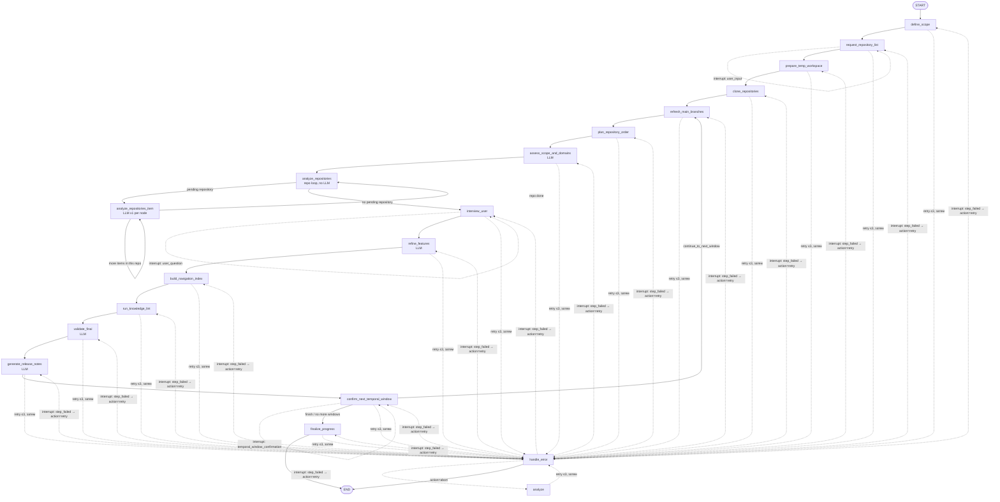

# Init Workflow — Graph Reference

Компактный справочник по `init_arch` LangGraph state machine: визуальная схема графа и разбор каждой ноды —
что делает, задействован ли LLM (и зачем), какие файлы формируются/меняются на диске, что происходит в
Postgres, что получаем на выходе в `session`, что происходит при ошибке, что логируется и видит пользователь,
и — человеческим языком — зачем этот шаг вообще существует.

Для истории реализации по этапам, quality gates, temporal contract и audit-событий — смотри
[init.md](init.md). Этот документ — навигационный срез, а не замена.

Источники: [graph.py](../../back/app/workflows/init_arch/graph.py),
[nodes.py](../../back/app/workflows/init_arch/nodes.py),
[steps.py](../../back/app/workflows/init_arch/domain/steps.py),
[prompts.py](../../back/app/workflows/init_arch/prompts.py).

## Визуальная схема



Правила, которые не влезли в картинку без клаттера ([graph.py](../../back/app/workflows/init_arch/graph.py)):

- **Retry.** Для любой ноды (кроме `handle_error`): если `state["step_error"]` не пуст и `retry_count < 3` —
  LangGraph повторяет **ту же самую** ноду; при `retry_count >= 3` — переход в `handle_error`.
  Это единственная общая retry-семантика, `_route_after_node()`.
- **`handle_error` — не дед-энд, а четвёртая точка паузы.** Раньше это было терминальное ребро в `END`; теперь
  нода сама делает `interrupt({"interrupt_type": "step_failed", ...})` и ждёт решение пользователя. На
  `action="retry"` граф возвращается **в ту самую ноду, которая упала** (`_route_after_handle_error()` читает
  `state["session"].current_step` — он не продвигается, пока упавшая нода не завершится успешно, поэтому это
  всегда именно она); `retry_count`/`step_error` при этом сбрасываются в 0/`None`, так что упавшая нода
  получает полный новый бюджет retry. На `action="abort"` — как и раньше, `END` и `WorkflowStatus.FAILED`.
  Подробности — в разделе про `handle_error` ниже.
- **Единственная развилка вне retry/error-петли** — после `confirm_next_temporal_window`: либо loop-back на
  `refresh_main_branches` (следующее temporal-окно), либо вперёд на `finalize_progress`
  (`_route_after_confirm_next_temporal_window()`).
- **Четыре точки паузы** (`interrupt(...)`, LangGraph останавливает граф и ждёт resume от пользователя):
  `request_repository_list`, `interview_user`, `confirm_next_temporal_window`, `handle_error`.

## Как читать таблицу по каждой ноде

Для каждой ноды:

- **Что делает** — по факту, из `nodes.py`.
- **LLM** — вызывается ли `claude`/`codex` через `_run_step_worker`/`_simple_llm_step`, и если да — какой
  reference-файл (`STEP_TO_REFERENCE`/`CHECKLIST_ITEM_TO_REFERENCE`) подмешивается в промпт поверх
  [SKILL.md](../../back/app/workflows/shared_assets/init_arch/SKILL.md); ссылка на сборку промпта —
  всегда [`build_step_prompt()`](../../back/app/workflows/init_arch/prompts.py#L186).
- **Файлы** — что физически появляется/меняется на диске (в `workspace_dir`/raw layer `.temp`/`arch_repo_dir`),
  а что — нет.
- **В базе** — что дополнительно к общему паттерну (см. ниже) пишется в Postgres.
- **На выходе** — что записывается в `session`/`InitArchState` и какой следующий `StepId`.
- **При ошибке** — что именно ловится и как это соотносится с общей retry/`handle_error` схемой выше.
- **Логи и что видит пользователь** — конкретный `structlog`-вызов + что долетает до клиента через SSE
  (`_conversation_item_to_sse_payload` в [init_arch_workflow.py](../../back/app/services/init_arch_workflow.py)).
- **Зачем (по-человечески)** — какую реальную задачу этот шаг решает, без терминов реализации.

### Общий паттерн для «В базе» (одинаков для всех 16 нод, кроме отмеченного отдельно)

Три независимых механизма персистентности срабатывают на **каждой** ноде, включая полностью детерминированные:

1. **Audit-события** — `WORKFLOW_STEP_STARTED` перед началом, `WORKFLOW_STEP_COMPLETED` (или `WORKFLOW_STEP_FAILED`)
   после; `WorkflowAuditService.record()` ([audit.py](../../back/app/workflows/init_arch/audit.py)) асинхронно
   (fire-and-forget task) дублирует их в таблицу **`conversation_items`** — это то, что видно как лог/таймлайн
   выполнения по `session_id`.
2. **`workflow_runs`** — после каждой ноды `_drive_graph_stream()` вызывает `apply_node_output()` +
   `persist_workflow_record()` ([init_arch_workflow.py:107](../../back/app/services/init_arch_workflow.py#L107)),
   который делает `upsert_workflow_run()` — целиком перезаписывает сериализованный `WorkflowRecord`, включая
   весь `session` (репозитории, artifacts, historical state, open questions), `current_step_id`,
   `pending_interrupt`. Это canonical source of truth о состоянии workflow.
3. **LangGraph checkpointer** — отдельно от двух вышеперечисленных, `AsyncPostgresSaver`
   ([checkpointer.py](../../back/app/workflows/init_arch/checkpointer.py)) чекпоинтит сам graph state (какая
   нода следующая, накопленный `InitArchState`) в своих собственных таблицах, по `thread_id = workflow_id`.
   Именно это позволяет `retry`/`resume` продолжать с места остановки после падения процесса.

Для LLM-нод (`_run_step_worker` → `LlmCliService.run_task()` → `task_runner.run_cli_task()`) добавляется
четвёртый источник: `EventType.LLM_TASK_REQUESTED` → `LLM_TASK_COMPLETED`/`LLM_TASK_FAILED`
([task_runner.py:293-312](../../back/app/services/task_runner.py#L293-L312)), плюс сам `CliTask` (prompt,
stdout, stderr, exit_code — с маскированием секретов и обрезкой, см. [init.md → Audit retention и masking](init.md#audit-retention-и-masking))
персистится в таблицу **`cli_tasks`**.

---

### 1. `define_scope` — не LLM

**Что делает** ([nodes.py:125](../../back/app/workflows/init_arch/nodes.py#L125)): инициализирует progress-файл
(`guard_service.init_progress`), затем `advance_step` на `request_repository_list`.

**LLM**: нет (убрано). Изначально нода звала агента, но `product_name`/`analysis_scope`/`repo_list` уже
приходят в `start_init_arch_workflow()` как typed API input — интерпретировать на этом шаге нечего, а
результат LLM-вызова никуда не парсился: переход на `REQUEST_REPOSITORY_LIST` шёл с захардкоженным
`note="Scope определён через LangGraph"`, не из `llm_result`. Единственным потребителем был `last_cli_output`
(чисто нарративный `cli_output` SSE-эвент для UX) — решили, что это не стоит реального LLM-вызова, и убрали
`_run_step_worker` из ноды. `StepDefinition.uses_llm_worker` для `DEFINE_SCOPE`
([steps.py:18](../../back/app/workflows/init_arch/domain/steps.py#L18)) приведён в соответствие (`False`).

**Файлы**: нет. Ни один файл на диске не создаётся и не меняется — `init_progress`/`advance_step` работают
только с in-memory `session`; `repo-initialization-progress.yaml` тоже не создаётся (см. ниже, раздел
«Compatibility-поле `progress_file_path`»).

**В базе**: только общий паттерн (`GUARD_COMMAND_REQUESTED`/`APPLIED` x2 — по разу от `init_progress` и от
`advance_step` — плюс `WORKFLOW_STEP_STARTED`/`COMPLETED`), без дополнений.

**На выходе**: `session.current_step = REQUEST_REPOSITORY_LIST`; `last_llm_result = None`.

**При ошибке**: любое исключение из `init_progress`/`advance_step` ловится общим `try/except`, эмитит
`WORKFLOW_STEP_FAILED`, возвращает `{"step_error": ..., "retry_count": +1}` → входит в общий retry-цикл графа.

**Логи и что видит пользователь**: `logger.info("workflow.node.define_scope", workflow_id=..., current_step=...)`
на старте; audit `WORKFLOW_STEP_STARTED` → `WORKFLOW_STEP_COMPLETED` (или `WORKFLOW_STEP_FAILED`) с payload
`next_step=...`. Пользователю через SSE это долетает как `{"event_type": "step_started", "step_id": "define_scope", ...}`
(см. `_conversation_item_to_sse_payload`, ветка `step_transition`).

**Зачем (по-человечески)**: это стартовая отметка — сервис фиксирует, что прогон вообще начался, под каким
именем продукта и с каким scope анализа, и переводит workflow в состояние "жду список репозиториев". Без
этого шага не с чем было бы сверять весь последующий прогресс.

---

### 2. `request_repository_list` — не LLM, ⏸ interrupt

**Что делает** ([nodes.py:164](../../back/app/workflows/init_arch/nodes.py#L164)): если `session.repositories`
уже заполнен — просто `advance_step` на `prepare_temp_workspace`; если нет —
`interrupt({"interrupt_type": "user_input", "field": "repo_list", "question": "..."})`.

**LLM**: нет. Это чистая маршрутизация/пауза на человека, промпт не строится.

**Файлы**: нет.

**В базе**: если пауза — только `WORKFLOW_STEP_STARTED` (без `COMPLETED`), но `persist_workflow_record()` всё
равно вызывается сразу после `apply_interrupt()` ([init_arch_workflow.py:748-749](../../back/app/services/init_arch_workflow.py#L748-L749))
— так что `pending_interrupt` и текущее состояние `session` уже лежат в `workflow_runs` до получения ответа
от пользователя (иначе `resume` после рестарта сервиса был бы невозможен).

**На выходе**: либо `session.current_step = PREPARE_TEMP_WORKSPACE`, либо граф останавливается и
`WorkflowRecord.pending_interrupt` заполняется interrupt-payload'ом.

**При ошибке**: ветка "репозитории уже есть" (`advance_step`) обёрнута в `try/except`, как и у всех остальных
нод — падение уходит в `step_error`/`retry_count` и проходит обычный retry/`handle_error` путь. Ветка
"нет списка" (`interrupt(...)`) намеренно **не** обёрнута — она должна свободно поднимать LangGraph-овское
control-flow исключение прерывания, а не перехватываться как ошибка шага.

**Логи и что видит пользователь**: `logger.info("workflow.node.request_repository_list", ...)`; при паузе —
audit `WORKFLOW_STEP_STARTED` без `WORKFLOW_STEP_COMPLETED` (граф просто остановлен). Пользователь получает
через SSE `{"event_type": "interrupted", "interrupt_type": "user_input", "field": "repo_list", "question": "Укажите список репозиториев..."}`
— это то, что фронт должен отрисовать как форму ввода.

**Зачем (по-человечески)**: получить от пользователя список репозиториев для анализа, если он не был передан
сразу при запуске. Без этого списка почти весь дальнейший pipeline (клонирование, анализ, документация)
бессмысленен — поэтому это первая точка, где сервис в принципе может остановиться и подождать человека.

---

### 3. `prepare_temp_workspace` — не LLM

**Что делает** ([nodes.py:248](../../back/app/workflows/init_arch/nodes.py#L248)): детерминированно создаёт на
диске `workspace_dir`, `raw_workspace_dir` и `arch_repo_dir` через хелпер `_prepare_workspace_directories()`
([nodes.py:240-245](../../back/app/workflows/init_arch/nodes.py#L240-L245)), который вызывает
`pathlib.Path(...).mkdir(parents=True, exist_ok=True)` на каждую директорию, и сразу `advance_step` на
`CLONE_REPOSITORIES`.

**LLM**: нет. Раньше это был `_simple_llm_step`, который просил CLI-агента выполнить те же `mkdir` внутри
контейнера — чистое файловое действие без какого-либо reasoning, поэтому шаг переведён на прямой Python-вызов
по аналогии с `refresh_main_branches`/`plan_repository_order` (см. `uses_llm_worker=False` в
[steps.py](../../back/app/workflows/init_arch/domain/steps.py#L30)). Промпт для этого шага больше не строится.

**Файлы**: сервис сам создаёт каталоги — `_resolve_init_arch_paths()`
([init_arch_workflow.py](../../back/app/services/init_arch_workflow.py)) резолвит и валидирует пути ещё на
старте workflow, но `mkdir` не вызывает, так что до этой ноды `workspace_dir` может физически не существовать.
Эта нода создаёт: сам `workspace_dir`, raw layer (по умолчанию `{workspace_dir}/.temp`,
`WORKFLOWS__INIT__RAW_WORKSPACE_SUBDIR`) и `arch_repo_dir` (по умолчанию `{workspace_dir}/arch-doc`,
`WORKFLOWS__INIT__ARCH_REPO_DIRNAME`). `mkdir(..., exist_ok=True)` — идемпотентно, повторный запуск/retry не
падает на уже существующих каталогах.

**В базе**: только `WORKFLOW_STEP_STARTED`/`COMPLETED`/`FAILED` — без `LLM_TASK_*` и без записи в `cli_tasks`,
как и у остальных не-LLM нод.

**На выходе**: `session.current_step = CLONE_REPOSITORIES`.

**При ошибке**: `try/except` вокруг `mkdir`/`advance_step` → `step_error` → retry ≤3 → `handle_error` (тот же
паттерн, что у `refresh_main_branches`).

**Логи и что видит пользователь**: `logger.info("workflow.node.prepare_temp_workspace", ...)`; audit
`WORKFLOW_STEP_STARTED`/`COMPLETED`/`FAILED`. Пользователю — `step_started`/следующий `step_started` по мере
продвижения; `cli_output` для этого шага не публикуется, т.к. CLI-агент не запускается.

**Зачем (по-человечески)**: подготовить рабочую площадку на диске — раздельные каталоги под "сырые"
исходники репозиториев и под итоговую документацию — прежде чем в них вообще что-то класть. Разделение layer'ов
важно: raw-слой только для чтения/checkout, arch-repo-слой только для synthesis-артефактов, они не должны
смешиваться.

---

### 4. `clone_repositories` — не LLM

**Что делает** ([nodes.py](../../back/app/workflows/init_arch/nodes.py)): для каждого репозитория из
`session.repositories` детерминированно вызывает `git clone <url> {raw_workspace_dir}/<repository_name>`
через `asyncio.create_subprocess_exec` (см. `_run_git_clone`/`_clone_repositories`). Раньше это был
`_simple_llm_step`, который просил CLI-агента выполнить тот же `git clone` внутри контейнера — чистая
shell-команда без reasoning, поэтому шаг переведён на прямой Python-вызов по аналогии с
`prepare_temp_workspace`/`refresh_main_branches`/`plan_repository_order` (`uses_llm_worker=False` в
[steps.py](../../back/app/workflows/init_arch/domain/steps.py#L36)). Промпт для этого шага больше не
строится — `build_step_prompt` больше не знает про `clone_repositories`.

**LLM**: нет. Backend-процесс сам делает сетевой git-clone: у него уже есть рабочий credential-helper
(`ensure_git_credentials_store()` из [git_credentials.py](../../back/app/services/git_credentials.py)) и
доступ к SSH-ключу для `git@`/`ssh://` URL — тот же самый механизм, которым уже пользуется
`check_git_access()`, и который раньше LLM-агент получал лишь потому, что наследовал `os.environ`
backend-процесса. Никакой изоляции сети/credentials между backend и бывшим CLI-агентом не было — перевод
на детерминированный вызов ничего не теряет.

**Идемпотентность и граничные случаи** (то, что раньше решал агент "по смыслу", теперь явно закодировано в
`_clone_repositories`):

- Если `{target_path}/.git` уже существует — репозиторий считается склонированным, `git clone` не
  запускается (safe retry/resume).
- Если `repository_url` пуст: репозиторий обязан уже существовать локально по целевому пути — иначе это
  явная ошибка (`ValueError`), а не тихий пропуск.
- Если целевая директория существует, но невалидна как git-checkout (обрывок прошлого неудачного клона) —
  она удаляется (`shutil.rmtree`) и клонирование повторяется с нуля.
- Клон всегда полный (без `--depth`) — `refresh_main_branches`/`plan_repository_order` читают `created_at`
  по первому коммиту и полный `git log`, shallow-clone сломал бы исторический анализ.
- `repository_name` валидируется (`_validate_repository_name`): пустая строка, `.`/`..` и `/`/`\` внутри
  имени отклоняются до построения пути на диске.
- Ошибки git классифицируются через `classify_git_access_failure()` (`auth_failed`/`timeout`/`error`) и
  попадают в текст `step_error`, чтобы пользователь в `required_action` видел причину, а не голый exit code.
- Таймаут на один `git clone` — 300s (`_GIT_CLONE_TIMEOUT_SECONDS`).

**Файлы**: полные checkout'ы репозиториев появляются в raw layer — `{raw_workspace_dir}/<repository_name>`
(например `.temp/svc-a/`), по одному подкаталогу на репозиторий из `session.repositories`. Это единственная
нода, где реально скачивается весь исходный код, с которым потом будет работать анализ.

**В базе**: только `WORKFLOW_STEP_STARTED`/`COMPLETED`/`FAILED` — без `LLM_TASK_*` и без записи в
`cli_tasks`, как и у остальных не-LLM нод.

**На выходе**: `session.current_step = REFRESH_MAIN_BRANCHES`.

**При ошибке**: `try/except` вокруг `_clone_repositories`/`advance_step` → `step_error` → retry ≤3 →
`handle_error` (тот же паттерн, что у `refresh_main_branches`).

**Логи и что видит пользователь**: `logger.info("workflow.node.clone_repositories", ...)` + те же
`WORKFLOW_STEP_*` события; `cli_output` для этого шага не публикуется, т.к. CLI-агент не запускается.
Пример реального провала: не удалось склонировать приватный репозиторий (нет доступа) → `git clone`
завершается ненулевым кодом → `RuntimeError("git clone failed for ... (auth_failed): ...")` → `step_error`
→ после 3 попыток `WORKFLOW_STEP_FAILED(step_id=clone_repositories, error=...)` → граф уходит в
`handle_error`, который приостанавливает workflow и ждёт решения пользователя — см. раздел про
`handle_error` ниже.

**Зачем (по-человечески)**: получить реальный исходный код репозиториев локально — без него анализировать
физически нечего, все последующие шаги (git log, чтение файлов, построение diff) работают именно с этими
checkout'ами.

---

### 5. `refresh_main_branches` — не LLM

**Что делает** ([nodes.py:381](../../back/app/workflows/init_arch/nodes.py#L381)):
`historical_service.refresh_main_branches(...)` — детерминированный git fetch/read main branch, remote HEAD,
`created_at` по каждому репозиторию.

**LLM**: нет. Чисто механическая git-операция, нет интерпретации контента.

**Файлы**: нет новых файлов и нет изменений working tree — только read-only git-команды внутри уже
склонированных репозиториев (`git rev-parse`, `git log -1 --format=...` и т.п., см.
`_read_repository_facts()` в [historical.py:417](../../back/app/workflows/init_arch/historical.py#L417)).
Working tree остаётся на том же коммите, на котором был после `clone_repositories`.

**В базе**: + `GUARD_COMMAND_REQUESTED`/`APPLIED(command="refresh_main_branches")` из
`HistoricalPrepService._record_event()`.

**На выходе**: `session.current_step = PLAN_REPOSITORY_ORDER`; заполнены `repositories[*].main_branch`,
`remote_head_commit`, `created_at`.

**При ошибке**: собственный `try/except` вокруг `historical_service.refresh_main_branches` +
`guard_service.advance_step` → `step_error` → тот же retry-цикл.

**Логи и что видит пользователь**: `logger.info("workflow.node.refresh_main_branches", ...)`; audit
`WORKFLOW_STEP_STARTED`/`COMPLETED` с `note=historical_result.summary` (человекочитаемая сводка, например
"3 repositories refreshed, 1 remote unreachable").

**Зачем (по-человечески)**: узнать актуальное состояние main branch каждого репозитория (текущий HEAD, дату
создания репозитория) — это опорные факты, без которых нельзя построить временную шкалу для исторического
анализа на следующем шаге.

---

### 6. `plan_repository_order` — не LLM

**Что делает** ([nodes.py:418](../../back/app/workflows/init_arch/nodes.py#L418)):
`historical_service.plan_repository_order(...)` (выбор anchor-репозитория, snapshot date, порядок обхода) +
`resolve_target_commits(..., checkout=True)` (резолв target-коммитов под дату и checkout).

**LLM**: нет.

**Файлы**: единственная детерминированная нода, которая реально **меняет содержимое working tree** —
`resolve_target_commits(..., checkout=True)` вызывает `git checkout <commit_sha>`
(`_checkout_commit()`, [historical.py:468](../../back/app/workflows/init_arch/historical.py#L468)) в каждом
репозитории из raw layer, переключая его на снапшот нужной даты. Новых файлов не создаётся, но состав файлов
в `.temp/<repo>` физически меняется на то, каким репозиторий был на выбранный `analysis_target_commit`.

**В базе**: + `GUARD_COMMAND_*` (`plan_repository_order`, `resolve_target_commits`) и temporal-события
`TEMPORAL_RANGE_REQUESTED`/`TEMPORAL_DIFF_COLLECTED`/`TEMPORAL_RANGE_RESOLVED`/`TEMPORAL_DIFF_MISSING`/`TEMPORAL_RANGE_INVALID`
— по одному набору на каждый repository-window (`_record_temporal_delta_event()`).

**На выходе**: `session.current_step = ASSESS_SCOPE_AND_DOMAINS`; заполнены `historical_analysis.*`,
`repositories[*].analysis_target_commit`, `commit_range*`, `diff_stat_summary`, `commit_log_summary` и т.д.
(temporal-delta слой — подробности в [init.md → Temporal Contract](init.md#temporal-contract)).

**При ошибке**: тот же паттерн `try/except` → `step_error` → retry. Отдельно стоит помнить про quality gate:
если historical prep не прошёл (`historical_prep_is_complete()` вернул `False`), `advance_step` кидает
`DomainOperationError` — это тоже попадает в тот же `except`, т.е. с точки зрения графа неотличимо от любой
другой ошибки шага (тот же retry/handle_error путь).

**Логи и что видит пользователь**: `logger.info("workflow.node.plan_repository_order", ...)`; audit `note`
объединяет `planned_result.summary` и `resolved_result.summary`. Пример: если для репозитория не удалось
построить commit range (`invalid_range`), это уже не ошибка самой ноды — нода завершится успешно, а
проблема всплывёт позже, на попытке перейти к `assess_scope_and_domains` (см. quality gate выше).

**Зачем (по-человечески)**: решить, в каком порядке и на каком именно "срезе времени" анализировать каждый
репозиторий (чтобы все репозитории описывались согласованно, "как будто сфотографированы в один момент"), и
физически переключить рабочие копии на этот момент — а заодно посчитать, что изменилось с прошлого такого
среза (diff), если это не первое окно.

---

### 7. `assess_scope_and_domains` — LLM (несколько вызовов подряд, по одному на репозиторий)

**Что делает** ([nodes.py:474](../../back/app/workflows/init_arch/nodes.py#L474)): для каждого репозитория
из `session.repositories` — `start_repository` (только чтобы `build_step_prompt()` корректно определил
"текущий репозиторий") → отдельный LLM-вызов → `_require_domain_assessment(...)`
([nodes.py:461](../../back/app/workflows/init_arch/nodes.py#L461)) достаёт структурный
`domain_assessment` из ответа или роняет `DomainOperationError` → `guard_service.assess_repository_domains(...)`
записывает результат в `session`. После цикла — `_require_domain_assessment_complete(...)`
([nodes.py:468](../../back/app/workflows/init_arch/nodes.py#L468)) как финальная защитная проверка →
`knowledge_service.write_domain_map(...)` → `advance_step` на `ANALYZE_REPOSITORIES`.

**LLM**: да, per repository. Reference: [checklist-scope-and-domain-assessment.md](../../back/app/workflows/shared_assets/init_arch/references/checklist-scope-and-domain-assessment.md)
([prompts.py:22](../../back/app/workflows/init_arch/prompts.py#L22)). Нужен LLM для смыслового разбиения
кодовой базы на домены — требует понимания структуры и назначения кода. В отличие от остальных LLM-шагов, у
этого есть дополнительный top-level ключ в JSON-контракте — `domain_assessment` (`volume_class`/`strategy`/
`domains`), подмешивается в эпилог промпта только для этого шага
(`_DOMAIN_ASSESSMENT_CONTRACT_BLOCK`, [prompts.py](../../back/app/workflows/init_arch/prompts.py)).

**Файлы**: агент может писать в `arch_repo_dir` по общей инструкции промпта, но структурный результат (объём
и домены) сюда не относится — он идёт через `domain_assessment` в JSON, а не через файлы. Единственный файл,
который реально пишется на этом шаге, — `architecture/domain-map.yaml`, и пишет его **backend
детерминированно**, а не агент: `KnowledgeArtifactService.write_domain_map(...)`
([knowledge.py:171](../../back/app/workflows/init_arch/knowledge.py#L171)) сериализует уже накопленный
`session.repositories[*].volume_class/.domain_strategy/.domains` через `yaml.safe_dump(...)` после цикла по
всем репозиториям — тем же путём, что `compile_navigation()` пишет `wiki/index.md` (нода 11). Этот вызов
регистрирует артефакт через `collect_worker_artifacts`-эквивалент (`_register_artifacts`), так что здесь,
в отличие от `analyze_repositories`/`validate_final`, `ARTIFACT_WRITTEN` реально эмитится.

**В базе**: `LLM_TASK_*`/`cli_tasks` на каждый репозиторий (аналогично `analyze_repositories`, но без
диффа по checklist item — один вызов на repository) + `GUARD_COMMAND_REQUESTED`/`APPLIED(command="domain_assess")`
на каждый репозиторий + `ARTIFACT_WRITTEN(architecture/domain-map.yaml)` один раз в конце.

**На выходе**: `session.current_step = ANALYZE_REPOSITORIES`; по каждому репозиторию заполнены
`volume_class`/`domain_strategy`/`domains` в `RepositoryExecution`; `architecture/domain-map.yaml` создан и
зарегистрирован в `session.artifacts`.

**При ошибке**: один `try/except` вокруг всего цикла по репозиториям в рамках **одного** физического узла (в
отличие от ноды 8, где цикл поднят в граф — см. ниже) — падение на любом репозитории (включая
`DomainOperationError` от `_require_domain_assessment`, если LLM не вернул `domain_assessment`) уводит узел в
`step_error`. **Retry здесь идемпотентен на уровне репозитория, но не на уровне графового чекпоинта**:
except-ветка возвращает `session` с уже накопленным прогрессом (а не только `step_error`/
`retry_count`, как в большинстве остальных нод), поэтому `apply_node_output()` фиксирует его в graph state
ещё до следующей попытки. При повторном заходе цикл пропускает репозитории, у которых
`domain_strategy is not None` (уже провалидированы в предыдущей попытке — `if repository.domain_strategy is
not None: continue`), и заново обращается к LLM только для того репозитория, на котором реально упало.
Это осознанный quality gate: шаг не может продвинуться на `ANALYZE_REPOSITORIES`, пока каждый репозиторий не
получил структурный assessment — раньше (до этой доработки) шаг проходил дальше молча, даже если LLM ничего
структурного не вернул.

**Логи и что видит пользователь**: те же `WORKFLOW_STEP_*` события; примечательно, что этот шаг требует
`requires_historical_prep=True` ([steps.py:54](../../back/app/workflows/init_arch/domain/steps.py#L54)) —
если historical prep неполный, сюда вообще не попадём (см. ноду 6). Пример реального провала: агент вернул
JSON без поля `domain_assessment` (забыл про него в отчёте) → `_require_domain_assessment` роняет
`DomainOperationError("missing domain assessment for repository ...")` → после 3 попыток
`WORKFLOW_STEP_FAILED` → `handle_error`.

**Зачем (по-человечески)**: решить, насколько крупный репозиторий и есть ли в нём выраженные бизнес-домены,
чтобы на следующем шаге анализировать его либо целиком, либо домен за доменом — и, в отличие от более ранней
версии этого шага, результат этого решения реально сохраняется структурно (в `session` и в
`architecture/domain-map.yaml`), а не растворяется в тексте одного LLM-ответа. Подробный план этой доработки
и мини-отчёты по каждой фазе — [2026-07-21-assess-scope-domain-persistence.md](../spec/2026-07-21-assess-scope-domain-persistence.md).

---

### 8. `analyze_repositories` / `analyze_repositories_item` — два физических узла графа, самый тяжёлый шаг

Логически это один шаг (`StepId.ANALYZE_REPOSITORIES`, одна запись в `completed_steps`), но физически в графе
он расщеплён на два узла с собственным self-loop/loop-back поверх conditional edges — по тому же паттерну,
что уже применяется для `confirm_next_temporal_window`/`refresh_main_branches`. Причина и полная история
реализации (три фазы, интеграционные тесты через реальный `compile_graph()`/`MemorySaver`) —
[2026-07-21-analyze-repositories-per-item-nodes.md](../spec/2026-07-21-analyze-repositories-per-item-nodes.md).
До этого расщепления весь цикл «репозитории × пункты чеклиста» жил внутри одного Python-цикла одной ноды —
persist (Postgres-чекпоинтер + YAML progress-снепшот) срабатывает только на границах физических узлов графа
(`_drive_graph_stream()` в `init_arch_workflow.py`), поэтому падение на 5-м пункте 2-го репозитория откатывало
**весь** шаг, а не только незавершённый пункт.

**`analyze_repositories`** ([nodes.py](../../back/app/workflows/init_arch/nodes.py), repo-loop entry, без LLM):
находит `next_pending_repository(session)` — первый репозиторий с `analysis_status != "completed"`. Если
такого нет — синхронизирует `open_questions` (если есть) и `advance_step` на `interview_user`. Если найден и
его `analysis_status == "pending"` — вызывает `start_repository` (помечает `in_progress`) и возвращает
`session` без advance; граф идёт дальше в `analyze_repositories_item`. Если репозиторий уже `in_progress`
(резюме после падения item-ноды) — `start_repository` повторно **не** вызывается.

**`analyze_repositories_item`** (обрабатывает ровно один пункт чеклиста текущего `in_progress` репозитория):
`route_checklist_items(...)` (детерминированно, без LLM, по diff severity) минус уже
`checklist_items_completed` → если пункт есть — один LLM-вызов (`task_kind=REPOSITORY_CHECKLIST_ITEM`) →
`complete_repository_item` → если найдены open questions — `register_open_questions`. Если пунктов не
осталось — `complete_repository` (помечает `analysis_status = "completed"`) без LLM-вызова. После каждого
исполнения узел возвращает управление графу — а значит, Postgres-чекпоинт и YAML-снепшот фиксируют прогресс
**по одному пункту**, а не по всему шагу целиком.

**LLM**: да, per checklist item. Своего единого reference у шага нет (`STEP_TO_REFERENCE["analyze_repositories"] = ""`);
вместо этого на каждый пункт подставляется свой файл через
[`CHECKLIST_ITEM_TO_REFERENCE`](../../back/app/workflows/init_arch/prompts.py#L33-L55)
(см. подстановку в [prompts.py:189-191](../../back/app/workflows/init_arch/prompts.py#L189-L191)). Кроме
чеклист-референса, промпт этого шага (и только этого шага) содержит отдельную секцию «Домены репозитория»
(`_build_domain_context_block()`) с результатом ноды 7 — `volume_class`/`strategy`/`domains` текущего
репозитория, плюс строка в инструкциях просить агента не пере-открывать домены через `find`/`ls`, а
использовать уже показанные. **Осознанное ограничение**: это только контекст для агента —
`route_checklist_items(...)` (детерминированный роутер ниже) домены не учитывает вообще, его решения
по-прежнему чисто path/diff-based; связывать домены с выбором чеклист-пунктов — отдельная, ещё не принятая
архитектурная задача (см. [2026-07-21-assess-scope-domain-persistence.md](../spec/2026-07-21-assess-scope-domain-persistence.md), Фаза 6).

| checklist item | reference |
|---|---|
| `repository_classification` | [checklist-repository-classification.md](../../back/app/workflows/shared_assets/init_arch/references/checklist-repository-classification.md) |
| `repository_structure_mapping` | [checklist-repository-structure-mapping.md](../../back/app/workflows/shared_assets/init_arch/references/checklist-repository-structure-mapping.md) |
| `entrypoints_and_interfaces` | [checklist-entrypoints-and-interfaces.md](../../back/app/workflows/shared_assets/init_arch/references/checklist-entrypoints-and-interfaces.md) |
| `business_flow_orchestration` | [checklist-business-flow-orchestration.md](../../back/app/workflows/shared_assets/init_arch/references/checklist-business-flow-orchestration.md) |
| `configs_and_runtime` | [checklist-configs-and-runtime.md](../../back/app/workflows/shared_assets/init_arch/references/checklist-configs-and-runtime.md) |
| `tech_stack_collection` | [checklist-tech-stack.md](../../back/app/workflows/shared_assets/init_arch/references/checklist-tech-stack.md) |
| `contracts_and_schemas` | [checklist-contracts-and-schemas.md](../../back/app/workflows/shared_assets/init_arch/references/checklist-contracts-and-schemas.md) |
| `data_and_storage` | [checklist-data-and-storage.md](../../back/app/workflows/shared_assets/init_arch/references/checklist-data-and-storage.md) |
| `domain_entities` | [checklist-domain-entities.md](../../back/app/workflows/shared_assets/init_arch/references/checklist-domain-entities.md) |
| `integrations_and_dependencies` | [checklist-integrations-and-dependencies.md](../../back/app/workflows/shared_assets/init_arch/references/checklist-integrations-and-dependencies.md) |
| `tests_and_behavior_evidence` | [checklist-tests-and-behavior-evidence.md](../../back/app/workflows/shared_assets/init_arch/references/checklist-tests-and-behavior-evidence.md) |
| `glossary_updates`, `open_questions_review_and_updates` | [checklist-glossary-and-open-questions.md](../../back/app/workflows/shared_assets/init_arch/references/checklist-glossary-and-open-questions.md) |
| `feature_discovery_and_updates`, `features_index_updates` | [checklist-features-and-index.md](../../back/app/workflows/shared_assets/init_arch/references/checklist-features-and-index.md) |
| `roles_and_permissions_updates`, `security_and_auth_updates`, `deployment_and_operability`, `risks_and_tech_debt_updates` | [checklist-roles-security-operability-risks.md](../../back/app/workflows/shared_assets/init_arch/references/checklist-roles-security-operability-risks.md) |
| `architecture_artifact_updates` | [checklist-architecture-artifact-updates.md](../../back/app/workflows/shared_assets/init_arch/references/checklist-architecture-artifact-updates.md) |
| `repository_consistency_review` | [checklist-repository-consistency-review.md](../../back/app/workflows/shared_assets/init_arch/references/checklist-repository-consistency-review.md) |

**Файлы**: это основной "пишущий" шаг всего workflow — агент реально читает код в raw layer и пишет находки
в `arch_repo_dir` (какие именно файлы — зависит от routed checklist item: `features/*.md`,
`architecture/*.md`, `architecture/contracts/*`, `architecture/storage/*.yml` и т.д., см. reference-таблицу
выше). **Находка**: `node_analyze_repositories_item` не вызывает `collect_worker_artifacts(...)` ни разу —
файлы, которые агент пишет здесь, физически появляются на диске, но не регистрируются в
`session.artifacts`/audit `ARTIFACT_WRITTEN`. Единственное, что регистрируется структурно —
`checklist_items_completed` (какие пункты прошли) и `open_questions` (если агент вернул
`open_questions_found` в JSON-контракте). В отличие от ноды 7, где артефакт (`architecture/domain-map.yaml`)
теперь пишет и регистрирует сам backend, здесь такого детерминированного пути нет — весь вывод целиком в
руках агента.

**В базе**: `DIFF_SIGNAL_ROUTED` на каждый репозиторий (routing-решение, эмитится из
`analyze_repositories_item` перед LLM-вызовом на первый найденный пункт) + `LLM_TASK_*`/`cli_tasks` на
**каждый** пункт чеклиста отдельно — на репозиторий с полным чеклистом это может быть 15-17 отдельных
LLM-вызовов, каждый со своей строкой в `cli_tasks`, и каждый — в отдельном физическом узле графа со своим
Postgres-чекпоинтом.

**На выходе**: `session.current_step = INTERVIEW_USER` (выставляется только `analyze_repositories`, когда
`next_pending_repository(session)` возвращает `None`); по каждому репозиторию — `checklist_items_completed`,
`analysis_status = "completed"`, новые `open_questions` (если найдены). Файлы в `arch_repo_dir` уже написаны
агентом, но в `session.artifacts` не отражены (см. «Файлы» выше).

**При ошибке**: у каждого из двух узлов свой `try/except` и свой retry-бюджет (≤3), полностью независимый от
соседних пунктов/репозиториев — так как один физический узел = один пункт чеклиста одного репозитория, а не
весь шаг целиком. Падение на LLM-вызове одного пункта уводит в `step_error` только этот пункт: соседние
пункты/репозитории, для которых `complete_repository_item`/`complete_repository` уже отработали, зафиксированы
в предыдущих чекпоинтах и **не** переигрываются при retry или при рестарте процесса (Postgres-чекпоинтер и
YAML-снепшот уже содержат их прогресс — оба узла на каждом входе заново вычисляют «что осталось» через
`next_pending_repository`/`next_pending_checklist_item`, а не хранят отдельную in-memory очередь). Подтверждено
интеграционными тестами через реальный `compile_graph()`/`MemorySaver` — см. спеку выше.

**Логи и что видит пользователь**: на каждый репозиторий — audit `DIFF_SIGNAL_ROUTED`
(`diff_severity`, `routed_items`, `total_items`); пользователю в UI имеет смысл показывать прогресс
"репозиторий N из M, пункт K из routed" — теперь это буквально соответствует физическому прогрессу по узлам
графа, а не только логическому счётчику внутри одной ноды. Пример реальной ошибки: агент вернул невалидный
JSON (не соответствует `LlmTaskResult`-контракту) → парсинг падает → `step_error` на этом пункте → после
исчерпания retry пользователь видит карточку `step_failed` с текстом ошибки парсинга и может нажать
«Повторить», не теряя
уже пройденные репозитории/пункты чеклиста (см. раздел про `handle_error`).

**Зачем (по-человечески)**: это и есть сам анализ — по каждому релевантному аспекту (структура кода, API,
данные и хранилища, безопасность, тесты и т.д.) агент реально читает исходники и пишет находки в
документацию. `route_checklist_items` заранее сужает объём работы для репозиториев, где изменилось немного
(diff-based routing), чтобы не гонять полный 17-пунктовый чеклист там, где это не нужно.

---

### 9. `interview_user` — LLM внутри цикла, ⏸ interrupt

**Что делает** ([nodes.py:563](../../back/app/workflows/init_arch/nodes.py#L563)): `while True` по открытым
`open_questions`: если вопросов нет — `advance_step` на `refine_features`; иначе `interrupt(...)` с текущим
вопросом → на resume `record_user_answer` → LLM reconciliation → `collect_worker_artifacts` →
`close_user_question` → `sync_open_questions` → следующая итерация.

**LLM**: да, `task_kind=INTERVIEW_RECONCILIATION`. Reference:
[checklist-glossary-and-open-questions.md](../../back/app/workflows/shared_assets/init_arch/references/checklist-glossary-and-open-questions.md)
([prompts.py:24](../../back/app/workflows/init_arch/prompts.py#L24)). Нужен LLM, чтобы интерпретировать
свободный ответ пользователя и обновить knowledge-артефакты соответствующим образом.

**Файлы**: `arch_repo_dir/open-questions.md` **перезаписывается целиком** на каждой итерации
(`sync_open_questions()` — рендерит markdown-таблицу заново из `session.open_questions`, не аппендит,
[knowledge.py:192](../../back/app/workflows/init_arch/knowledge.py#L192)). Плюс агент во время
`INTERVIEW_RECONCILIATION`-вызова может создавать/обновлять knowledge-файлы по итогам ответа пользователя —
эти уже регистрируются через `collect_worker_artifacts` (в отличие от нод 7-8).

**В базе**: + `USER_ANSWER_RECORDED` на каждый принятый ответ, `ARTIFACT_WRITTEN(open-questions.md)` на
каждую итерацию, `ARTIFACT_WRITTEN` на артефакты, которые реально вернул агент, `LLM_TASK_*`/`cli_tasks` на
каждый LLM-вызов reconciliation.

**На выходе**: закрытые `open_questions[*].status = "answered"`, обновлённый `open-questions.md`; когда
вопросов не осталось — `session.current_step = REFINE_FEATURES`.

**При ошибке**: один `try/except` вокруг всего `while`-цикла — падение на любой итерации (например, ответ
пользователя пустой — см. `_extract_question_answer`, кидает `ValueError`) уводит весь узел в `step_error` и
общий retry.

**Логи и что видит пользователь**: audit `USER_ANSWER_RECORDED` на каждый принятый ответ. Пользователь видит
серию SSE `interrupted` (`{"event_type": "interrupted", "interrupt_type": "user_question", "question_id": "Q-3", "question": "...", "remaining_count": 2}`)
— по одному на каждый открытый вопрос, до полного закрытия списка.

**Зачем (по-человечески)**: разрешить неоднозначности, которые агент не смог закрыть сам во время анализа
(например, непонятно назначение модуля, или неясно, кто отвечает за конкретный домен). Без ответа
пользователя часть документации так и осталась бы помечена как открытый вопрос.

---

### 10. `refine_features` — LLM

**Что делает** ([nodes.py:649](../../back/app/workflows/init_arch/nodes.py#L649)):
`knowledge_service.bootstrap_arch_repo` (детерминированно создаёт скелет `features/`, `architecture/`,
`wiki/`) → LLM пишет/уточняет фичи → `collect_worker_artifacts` фиксирует созданные файлы.

**LLM**: да. Reference: [checklist-features-and-index.md](../../back/app/workflows/shared_assets/init_arch/references/checklist-features-and-index.md)
([prompts.py:25](../../back/app/workflows/init_arch/prompts.py#L25)). Нужен для синтеза текстовых
артефактов фич из собранных находок.

**Файлы**: `bootstrap_arch_repo()` ([knowledge.py:85](../../back/app/workflows/init_arch/knowledge.py#L85))
детерминированно создаёт каталоги `features/`, `architecture/`, `architecture/integrations`,
`architecture/contracts`, `architecture/storage`, `architecture/structure`, `release-notes/`, `wiki/`,
`wiki/maps/` и — **только если файла ещё нет** (`if target_path.exists(): continue`) — заполняет из
шаблонов: `features-index.md`, `glossary.md`, `open-questions.md`, `wiki/index.md`, `wiki/log.md`,
`wiki/maps/compile-report.md` и 10 одиночных `architecture/*.md`/`architecture/landscape.yaml`
(`_ARCHITECTURE_TEMPLATE_ASSETS`). После этого LLM пишет/уточняет сами файлы фич в `features/*.md`.

**В базе**: `ARTIFACT_WRITTEN` на каждый реально созданный bootstrap-файл (не на пропущенные существующие) +
`ARTIFACT_WRITTEN` на каждый артефакт, который вернул агент, + `LLM_TASK_*`/`cli_tasks`.

**На выходе**: `session.current_step = BUILD_NAVIGATION_INDEX`; новые/обновлённые файлы в
`arch_repo_dir/features/*`.

**При ошибке**: стандартный путь (`try/except` → `step_error` → retry).

**Логи и что видит пользователь**: audit `ARTIFACT_WRITTEN` на каждый созданный/обновлённый файл —
это то, что стоит показывать пользователю как "создан файл features/checkout.md" по мере прогона.

**Зачем (по-человечески)**: заложить структуру будущей документации (каталоги и файлы-заглушки, если их ещё
нет) и описать сами фичи продукта — это первый шаг, где сырые находки из анализа превращаются в
человекочитаемые артефакты, а не просто накапливаются в session state.

---

### 11. `build_navigation_index` — не LLM

**Что делает** ([nodes.py:696](../../back/app/workflows/init_arch/nodes.py#L696)):
`knowledge_service.compile_navigation(...)` — механическая сборка `wiki/index.md` и
`wiki/maps/compile-report.md` по уже написанным файлам.

**LLM**: нет. Хотя в `STEP_TO_REFERENCE` для этого шага числится
[knowledge-workflow.md](../../back/app/workflows/shared_assets/init_arch/references/knowledge-workflow.md)
([prompts.py:26](../../back/app/workflows/init_arch/prompts.py#L26)) — это мёртвая запись, промпт для этой
ноды никогда не строится, т.к. `_run_step_worker` тут не вызывается вовсе. Стоит либо убрать эту строку из
словаря, либо (если по замыслу здесь должен быть LLM-шаг) добавить вызов.

**Файлы**: `wiki/index.md` и `wiki/maps/compile-report.md` **перезаписываются целиком** —
`compile_navigation()` ([knowledge.py:135](../../back/app/workflows/init_arch/knowledge.py#L135)) читает уже
существующие markdown-файлы в `arch_repo_dir` (в первую очередь то, что написали ноды 8/10) и пересобирает
индекс/отчёт заново. Новых знаний не добавляет — только переупаковывает уже написанное.

**В базе**: `ARTIFACT_WRITTEN` x2 (по одному на каждый из двух файлов).

**На выходе**: `session.current_step = RUN_KNOWLEDGE_LINT`.

**При ошибке**: `try/except` вокруг `compile_navigation` → `step_error` → retry.

**Логи и что видит пользователь**: audit `ARTIFACT_WRITTEN(wiki/index.md)`, `ARTIFACT_WRITTEN(wiki/maps/compile-report.md)`.

**Зачем (по-человечески)**: собрать оглавление и карту связей по уже написанной документации, чтобы по ней
можно было ориентироваться (найти нужный файл, увидеть неразрешённые ссылки), не читая весь repo целиком.

---

### 12. `run_knowledge_lint` — не LLM

**Что делает** ([nodes.py:733](../../back/app/workflows/init_arch/nodes.py#L733)):
`knowledge_service.lint_knowledge(...)` — формальные структурные проверки knowledge-слоя (residue от
шаблонов, обязательные файлы, контракты OpenAPI/AsyncAPI, консистентность commit между landscape и structure
— см. [init.md → Knowledge Pipeline Gates](init.md#knowledge-pipeline-gates)).

**LLM**: нет — reference [knowledge-workflow.md](../../back/app/workflows/shared_assets/init_arch/references/knowledge-workflow.md)
тоже мёртвый по той же причине, что и в ноде 11.

**Файлы**: нет — `lint_knowledge()` ([knowledge.py:169](../../back/app/workflows/init_arch/knowledge.py#L169))
только читает файлы в `arch_repo_dir` и валидирует их (residue от шаблонов, обязательные секции, контракты
OpenAPI/AsyncAPI, консистентность commit между landscape и structure), ничего не пишет
(`written_artifacts=[]` всегда).

**В базе**: без дополнений к общему паттерну — `ARTIFACT_WRITTEN` не эмитится.

**На выходе**: `session.current_step = VALIDATE_FINAL`.

**При ошибке**: важное отличие от прочих — `lint_knowledge` при blocking-проблемах не просто "падает
случайно", а осознанно кидает `ValueError` с текстом вида `"ERROR: ..."` при обнаруженных нарушениях; это
всё равно попадает в тот же общий `try/except` → `step_error` → retry ≤3 → `handle_error`, т.е. с точки
зрения графа неотличимо от инфраструктурной ошибки — семантика "это осмысленный lint-fail, а не баг"
теряется на уровне графа и видна только в тексте `error_message`.

**Логи и что видит пользователь**: audit `note=lint_result.summary`. Пример: после трёх неудачных попыток
пользователь увидит карточку `step_failed` с текстом вида
`"ERROR: architecture/hld.md still contains template placeholder <...>"` и выбор «Повторить» (после ручного
фикса шаблона) или «Прервать».

**Зачем (по-человечески)**: проверить, что документация не осталась с незаполненными шаблонными
плейсхолдерами, битыми ссылками между секциями или рассинхронизированными commit'ами между обзорным и
детальным слоями — прежде чем считать анализ содержательно завершённым, а не просто "все шаги пройдены".

---

### 13. `validate_final` — LLM (несмотря на `uses_llm_worker=False` в декларации шага)

**Что делает** ([nodes.py:770](../../back/app/workflows/init_arch/nodes.py#L770)): `_simple_llm_step` —
просит агента выполнить финальную ревизию консистентности knowledge-слоя.

**LLM**: да, фактически. Reference:
[checklist-repository-consistency-review.md](../../back/app/workflows/shared_assets/init_arch/references/checklist-repository-consistency-review.md)
([prompts.py:28](../../back/app/workflows/init_arch/prompts.py#L28)). **Несостыковка**: в
[steps.py:88](../../back/app/workflows/init_arch/domain/steps.py#L88) шаг объявлен как
`uses_llm_worker=False`, но `node_validate_final` жёстко вызывает `_simple_llm_step`, которая всегда зовёт
`_run_step_worker`. Похоже, поле `uses_llm_worker` в `StepDefinition` сейчас не влияет на реальное
поведение ноды (просто метаданные/декларация) — стоит либо синхронизировать флаг, либо перепроверить, где
ещё он используется.

**Файлы**: как и в нодах 7-8, агент может писать/дополнять файлы в `arch_repo_dir` по общей инструкции
промпта, но `node_validate_final` тоже не вызывает `collect_worker_artifacts` — реальные правки (если агент
их вносит в рамках "финальной ревизии") на диске появляются, но в `session.artifacts`/`ARTIFACT_WRITTEN` не
регистрируются.

**В базе**: + `LLM_TASK_*`/`cli_tasks`, без `ARTIFACT_WRITTEN`.

**На выходе**: `session.current_step = GENERATE_RELEASE_NOTES`.

**При ошибке**: стандартный `_simple_llm_step` путь.

**Логи и что видит пользователь**: стандартные `WORKFLOW_STEP_*` события.

**Зачем (по-человечески)**: финальная ревизия консистентности всего knowledge-слоя целиком (не файл за
файлом, как в `run_knowledge_lint`, а по смыслу) — человекоподобная проверка "не противоречит ли одна часть
документации другой" перед тем, как переходить к генерации release notes.

---

### 14. `generate_release_notes` — LLM

**Что делает** ([nodes.py:779](../../back/app/workflows/init_arch/nodes.py#L779)): зовёт агента с
контекстным блоком release notes (`_build_release_notes_context_block`, temporal delta текущего окна) →
`collect_worker_artifacts` → `advance_step`.

**LLM**: да. Reference: [checklist-release-notes.md](../../back/app/workflows/shared_assets/init_arch/references/checklist-release-notes.md)
([prompts.py:29](../../back/app/workflows/init_arch/prompts.py#L29)). Нужен для генерации связного текста
на основе диффов окна.

**Файлы**: один новый файл с именем по строгому шаблону —
`release-notes/window-<window_index>-<snapshot_date>.md` (например `release-notes/window-3-2020-01-01.md`,
[checklist-release-notes.md:7](../../back/app/workflows/shared_assets/init_arch/references/checklist-release-notes.md#L7)),
куда агент пишет summary изменений за текущее temporal-окно со ссылками на изменённые артефакты.

**В базе**: `ARTIFACT_WRITTEN` на этот файл + `LLM_TASK_*`/`cli_tasks`.

**На выходе**: `session.current_step = CONFIRM_NEXT_TEMPORAL_WINDOW`; новый файл release notes за окно.

**При ошибке**: стандартный путь (`try/except` вокруг worker + `collect_worker_artifacts` + `advance_step`).

**Логи и что видит пользователь**: audit `ARTIFACT_WRITTEN` на файл release notes, `note=knowledge_result.summary`.

**Зачем (по-человечески)**: зафиксировать человекочитаемое summary того, что реально поменялось в продукте с
прошлого temporal-снапшота — это то, что можно показать человеку без необходимости читать все diff'ы и
внутренние артефакты самому.

---

### 15. `confirm_next_temporal_window` — не LLM, ⏸ interrupt, единственная развилка вне error-петли

**Что делает** ([nodes.py:839](../../back/app/workflows/init_arch/nodes.py#L839)):
`historical_service.compute_next_window(...)`; если следующего окна нет — сразу `advance_step` на
`finalize_progress`; если есть — `interrupt({"interrupt_type": "temporal_window_confirmation", "next_snapshot_at": ...})`,
на resume читает `action` (`continue_to_next_window` / `finish_temporal_analysis`). При `continue` — сбрасывает
`checklist_items_completed`/`analysis_status` у всех репозиториев и уходит на `refresh_main_branches`
(реальный loop-back графа); при `finish` — на `finalize_progress`.

**LLM**: нет. Чисто управляющая логика дат/state.

**Файлы**: нет — только сброс `checklist_items_completed`/`analysis_status` у репозиториев в `session` (не
файлы), если пользователь выбрал продолжить.

**В базе**: без дополнений к общему паттерну (кроме сохранения `pending_interrupt` перед паузой, как у любой
interrupt-ноды — см. ноду 2).

**На выходе**: либо `session.current_step = REFRESH_MAIN_BRANCHES` (новый цикл), либо
`session.current_step = FINALIZE_PROGRESS`.

**При ошибке**: `try/except` вокруг всей ноды; отдельно — `_extract_window_confirmation_action` кидает
`ValueError`, если resume payload не содержит валидного `action` — тоже уходит в `step_error`/retry.

**Логи и что видит пользователь**: SSE `interrupted` с `{"interrupt_type": "temporal_window_confirmation", "current_snapshot_at": "...", "next_snapshot_at": "...", "window_index": N}`
— это то место, где пользователь явно решает, продолжать ли исторический анализ дальше во времени.

**Зачем (по-человечески)**: решить, нужно ли реконструировать ещё один temporal-срез истории продукта
(например, следующий квартал), или на текущем моменте реконструкция закончена. Явное подтверждение
пользователя — осознанное решение, а не автоматическое зацикливание до бесконечности.

---

### 16. `finalize_progress` — не LLM, terminal

**Что делает** ([nodes.py:921](../../back/app/workflows/init_arch/nodes.py#L921)):
`guard_service.finalize_progress(...)` — закрывающая механика progress-файла/сессии.

**LLM**: нет.

**Файлы**: нет.

**В базе**: без дополнений к общему паттерну; сразу после ноды `run_workflow()` дополнительно апдейтит
верхнеуровневый `record.workflow_status` (`SUCCESS`/`FAILED`) в том же `workflow_runs`.

**На выходе**: `session.status` фиксируется как завершённый; это последняя нода перед `END` (или
`handle_error`, если и она сама упадёт после исчерпания retry — единственная нода с отдельным условным
ребром вне общего `_route_after_node()`, `graph.py:105-108`).

**При ошибке**: тот же `try/except` → `step_error` → retry ≤3 → `handle_error` → `END`.

**Логи и что видит пользователь**: после этой ноды `run_workflow()` выставляет
`WorkflowStatus.SUCCESS`/`FAILED` на верхнем уровне ([init_arch_workflow.py:796-798](../../back/app/services/init_arch_workflow.py#L796-L798)),
пользователь получает финальный SSE `{"event_type": "workflow_done", "workflow_status": "success"}`.

**Зачем (по-человечески)**: формально закрыть workflow run — зафиксировать, что все данные собраны и сессия
завершена, чтобы UI и API перестали ждать дальнейших событий и показали финальный статус.

---

## `handle_error` — не LLM, ⏸ interrupt, точка восстановления после отказа шага

**Что делает** ([nodes.py:954](../../back/app/workflows/init_arch/nodes.py#L954)): логирует
(`logger.error("workflow.node.error", step=..., error=..., retry_count=...)`), затем **сама делает паузу**:

```python
resume_payload = interrupt({
    "interrupt_type": "step_failed",
    "step_id": step_id.value,
    "step_title": STEP_DEFINITION_BY_ID[step_id].title,
    "error": step_error,
    "retry_count": retry_count,
})
```

и ждёт от пользователя `{"action": "retry"}` или `{"action": "abort"}`
(`_extract_step_failure_recovery_action()`, зеркало `_extract_window_confirmation_action` у
`confirm_next_temporal_window`). На `"retry"` возвращает `{"step_error": None, "retry_count": 0}` — граф
маршрутизируется обратно в упавшую ноду с чистым retry-бюджетом (`_route_after_handle_error()` в
[graph.py](../../back/app/workflows/init_arch/graph.py), читает `state["session"].current_step`, которая всё
ещё указывает на упавший шаг — `advance_step` для него так и не выполнился). На `"abort"` возвращает
`step_error`/`retry_count` как есть — граф уходит в `END`, а `run_workflow()` ставит `FAILED`, как и раньше.

Это переиспользует ровно тот же generic interrupt/resume путь, что и три других паузы в графе: LangGraph
репортит `handle_error` через `__interrupt__`-событие, `_drive_graph_stream()` → `apply_interrupt()` кладёт
payload в `record.pending_interrupt` без единой правки в этой функции, а SSE-билдер
(`{"event_type": "interrupted", **(record.pending_interrupt or {})}`) автоматически прокидывает
`step_id`/`step_title`/`error`/`retry_count` пользователю — новых полей в транспортном слое не потребовалось.

**Что в итоге получает пользователь при отказе шага** (сквозной пример по всей цепочке):

1. Нода (например, `clone_repositories`) 3 раза подряд ловит `step_error`, ретраи исчерпаны →
   `_route_after_node()` ведёт в `handle_error`.
2. `handle_error` логирует и вызывает `interrupt({"interrupt_type": "step_failed", "step_id": "clone_repositories", "step_title": "Clone repositories", "error": "...", "retry_count": 3})`.
3. `_drive_graph_stream()` видит `__interrupt__` → `record.workflow_status = WorkflowStatus.INTERRUPTED`,
   `record.pending_interrupt` = payload interrupt'а.
4. Пользователь получает через SSE `{"event_type": "interrupted", "interrupt_type": "step_failed", "step_id": "clone_repositories", "step_title": "Clone repositories", "error": "...", "retry_count": 3}`
   — фронт (`RequiredActionCard`, [required-action-card.tsx](../../front/src/features/workflow/required-action-card.tsx))
   рендерит карточку с шагом, полным текстом ошибки, числом попыток и кнопками «Повторить»/«Прервать».
5. Клик «Повторить» → `POST /api/rest/responses/{response_id}/actions/` с `{"action_type": "retry"}` →
   `submit_response_action_async()` → `retry_init_arch_workflow(workflow_id, action="retry")`
   ([init_arch_workflow.py](../../back/app/services/init_arch_workflow.py)) → `schedule_resume(record, resume_value={"action": "retry"})`
   → `graph.astream({"action": "retry"}, config={"configurable": {"thread_id": workflow_id}})` продолжает
   **тот же** LangGraph `thread_id`/checkpoint — не новый workflow, не новая сессия. `handle_error`
   резолвится в `{"step_error": None, "retry_count": 0}`, граф возвращается в `clone_repositories` и
   выполняет его заново с уже накопленным `session` (репозитории, artifacts, historical state — всё, что
   было собрано до сбоя, сохраняется).
6. Клик «Прервать» → `{"action_type": "retry", "value": "abort"}` → тот же `retry_init_arch_workflow(..., action="abort")`
   → `handle_error` возвращает исходный `step_error` → граф в `END` → `WorkflowStatus.FAILED`,
   `record.error_message = step_error`, финальный SSE `{"event_type": "workflow_failed", "error_message": "..."}`
   — как и раньше, но теперь это осознанный выбор пользователя, а не единственный возможный исход.

Отдельный путь отказа — необработанное исключение вне графа (например, в `compile_graph`/`get_checkpointer`
до первого `astream`): тогда `run_workflow()` ловит его собственным внешним `except Exception`
([init_arch_workflow.py:811-815](../../back/app/services/init_arch_workflow.py#L811-L815)) и сразу ставит
`FAILED` + `error_message = str(exc)` — без прохода через `handle_error`/retry графа и без возможности
retry вообще. Это по-прежнему единственный по-настоящему терминальный путь отказа; все отказы *внутри* графа
(включая `request_repository_list`, у которой раньше не было своего `try/except`, — теперь исправлено) идут
через retryable `handle_error`.

**Файлы**: сам `handle_error` ничего не пишет — но важно понимать, что файлы, уже написанные упавшей нодой
или предыдущими нодами (например, частично записанные knowledge-артефакты из `analyze_repositories`),
**остаются на диске как есть** между падением и повтором — retry не откатывает файловые изменения, только
`step_error`/`retry_count` в state графа.

**В базе**: `pending_interrupt` с полным payload'ом (`step_id`/`step_title`/`error`/`retry_count`) уходит в
`workflow_runs` тем же путём, что и у любой другой interrupt-ноды (нода 2) — до получения ответа пользователя.

**Зачем (по-человечески)**: не терять уже проделанную работу при сбое. Раньше единственный вариант при
падении шага — начинать весь workflow заново с нуля; теперь пользователь видит, что именно и почему упало, и
может либо попробовать тот же шаг ещё раз (например, после того как почитал права доступа к репозиторию),
либо осознанно прервать прогон.

## Progress-снепшот `progress_file_path` и восстановление на другой машине

`progress_file_path` (`{arch_repo_dir}/repo-initialization-progress.yaml`, формируется в
[init_arch_workflow.py:960](../../back/app/services/init_arch_workflow.py#L960) для обычного запуска
`start_init_arch_workflow`; для восстановленного из снепшота workflow тот же путь независимо
формируется ещё раз в
[init_arch_workflow.py:1037](../../back/app/services/init_arch_workflow.py#L1037) внутри
`resume_init_arch_workflow_from_snapshot`) реально пишется —
не самой нодой графа, а централизованным хуком в `_drive_graph_stream()`
([init_arch_workflow.py](../../back/app/services/init_arch_workflow.py)), который срабатывает после
**каждого** node output и на каждом `__interrupt__`, тем же способом, каким пишется `workflow_runs`
(`persist_workflow_record`). Формат — YAML-сериализация
[`WorkflowSnapshot`](../../back/app/workflows/init_arch/snapshot.py): `schema_version`,
`workflow_id`, `workspace_dir`, `arch_repo_dir`, `engine_name`, `timeout_seconds`, `updated_at`,
`session` (полный `WorkflowSessionRecord`). Запись — best-effort и атомарная (временный файл +
`os.replace()`); ошибка логируется как `workflow.snapshot_persist_failed` и не прерывает workflow —
тот же паттерн, что и `workflow.persist_failed` у `persist_workflow_record`.

**Canonical state по-прежнему Postgres** (`workflow_runs` + LangGraph checkpointer) — этот файл не
участвует в retry/interrupt/resume рантайме **текущего** запуска. Его основное назначение —
человекочитаемый, диффуемый, коммитящийся в git снепшот прогресса рядом с остальными
knowledge-артефактами в `arch_repo_dir`.

**Восстановление на другой машине.** MCP-инструмент
[`resume_init_arch_from_snapshot`](../../back/app/mcp_server.py) читает этот файл с диска и вызывает
[`resume_init_arch_workflow_from_snapshot()`](../../back/app/services/init_arch_workflow.py), которая:

1. парсит YAML в `WorkflowSnapshot`;
2. создаёт **новый** `workflow_id`/`WorkflowRecord` (старый `thread_id` в checkpointer'е новой
   машины/БД всё равно недоступен);
3. если `session.current_step` уже `DONE` — сразу помечает запись `SUCCESS`, фоновую задачу не
   запускает;
4. иначе вычисляет `as_node = session.completed_steps[-1]` и запускает
   `run_workflow(record, initial_state, as_node=as_node)`.

`run_workflow` при заданном `as_node` сначала вызывает `graph.aupdate_state(config, values,
as_node=as_node)` — это досоздаёт LangGraph checkpoint нового `thread_id` «как будто» узел
`as_node` только что отработал, — и только потом стримит дальше с `stream_input=None` (LangGraph
продолжает с последнего checkpoint). Это принципиально не то же самое, что заново прогнать граф с
`START`, подставив уже заполненный `session`: `plan_repository_order` (`historical.py`) безусловно
сбрасывает per-repo поля анализа на каждый прогон, поэтому наивный replay уничтожил бы уже
накопленный прогресс. Сидирование через `as_node` этого избегает — уже пройденные узлы не
выполняются повторно, граф стартует ровно с `session.current_step`.

## Известные несостыковки, найденные при разборе

1. `STEP_TO_REFERENCE["build_navigation_index"]` и `["run_knowledge_lint"]` указывают на
   [knowledge-workflow.md](../../back/app/workflows/shared_assets/init_arch/references/knowledge-workflow.md),
   но обе ноды никогда не вызывают LLM — файл фактически мёртвый в контексте промптов.
2. `StepDefinition.uses_llm_worker=False` для `validate_final` ([steps.py:88](../../back/app/workflows/init_arch/domain/steps.py#L88))
   не соответствует реальному коду ноды (`_simple_llm_step` всегда зовёт LLM). Поле, похоже, сейчас не
   является source of truth для поведения графа.
3. `run_knowledge_lint` кодирует смысловой "lint failed" как обычное исключение — на уровне графа это
   неотличимо от инфраструктурного сбоя (сеть, таймаут CLI и т.д.), различие видно только в тексте
   `error_message`, который пользователь увидит в карточке `step_failed` перед тем, как решить —
   повторять или прерывать.
4. Две LLM-ноды — `analyze_repositories_item`, `validate_final` — не вызывают
   `knowledge_service.collect_worker_artifacts(...)`, в отличие от `refine_features`/`interview_user`/
   `generate_release_notes`. Файлы, которые агент пишет в `arch_repo_dir` на этих шагах, физически
   появляются на диске, но не попадают в `session.artifacts` и не эмитят audit `ARTIFACT_WRITTEN` — то есть
   artifact-registry (то, на что опирается `wiki/index.md`/`compile-report.md` и общая наблюдаемость) не
   полный. `assess_scope_and_domains` больше не входит в этот список — там артефакт (`architecture/domain-map.yaml`)
   пишет и регистрирует сам backend, а не агент (см. ноду 7 выше).
5. ~~`RepositoryExecution.domain_strategy`/`.domains` нигде не заполняются~~ — исправлено: `assess_scope_and_domains`
   теперь структурно сохраняет `volume_class`/`domain_strategy`/`domains` через `guard_service.assess_repository_domains(...)`
   и пишет `architecture/domain-map.yaml`; `analyze_repositories` теперь тоже показывает эти поля агенту
   (секция «Домены репозитория» в промпте, см. ноду 8 выше). Подробности —
   [2026-07-21-assess-scope-domain-persistence.md](../spec/2026-07-21-assess-scope-domain-persistence.md).
   Оставшееся более узкое расхождение: `route_checklist_items(...)` — детерминированный роутер чеклиста
   внутри той же ноды — домены по-прежнему не учитывает, роутинг остаётся чисто path/diff-based; агент видит
   домены как контекст, но структурно они на выбор чеклист-пунктов не влияют (см. Фазу 6 той же спеки).
6. ~~`progress_file_path` не создаётся и не пишется~~ — исправлено: `_drive_graph_stream()` пишет
   YAML-снепшот на каждый шаг, а `resume_init_arch_from_snapshot` умеет по нему восстановить
   workflow на другой машине — см. раздел «Progress-снепшот `progress_file_path` и восстановление
   на другой машине» выше.
