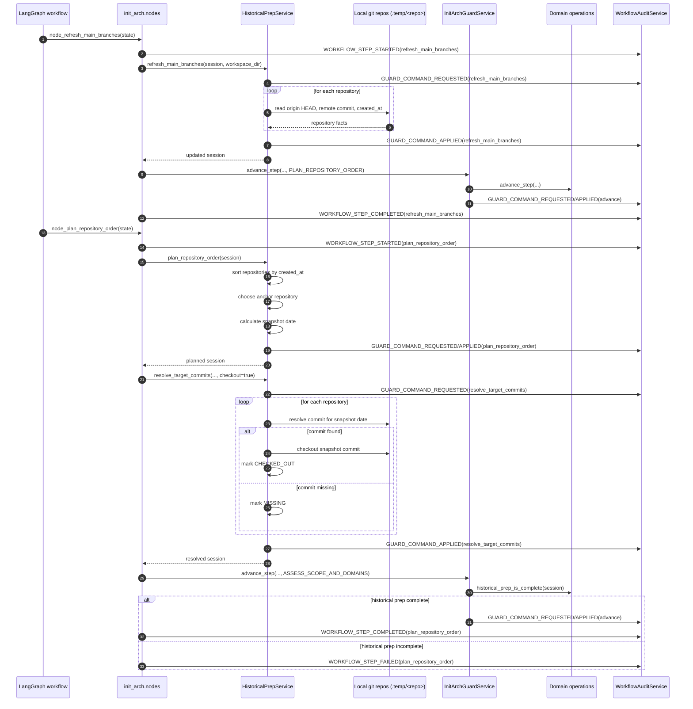
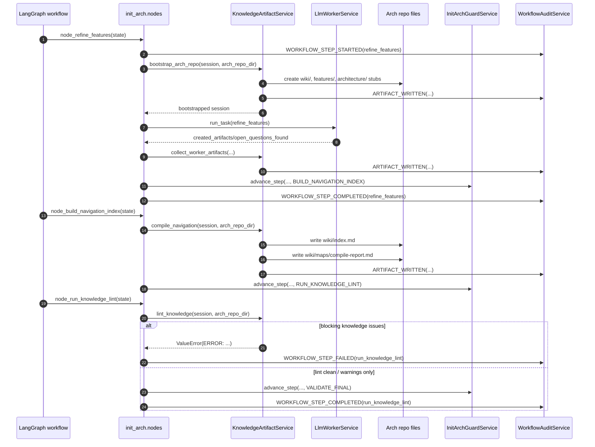
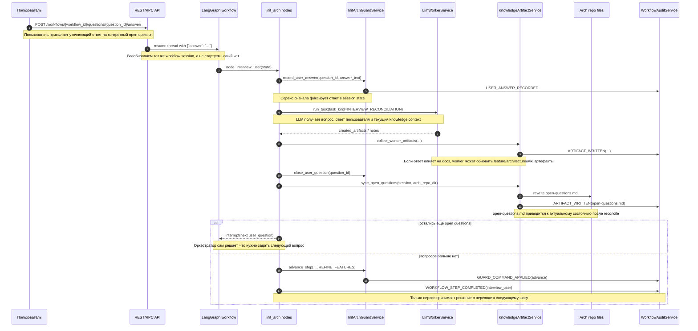

# Init Workflow

## Назначение

`init` workflow запускает первичную инициализацию архитектурной документации по продукту и проводит сервис через полный pipeline `init_arch`: от определения scope и списка репозиториев до knowledge lint и финализации workflow session.

Документ фиксирует текущее состояние backend-реализации в `arch-docs`, включая уже реализованные шаги и известные разрывы с целевым `init-repo-arch-skill`.

## Entrypoints

### REST / RPC

- `POST /api/rest/workflows/init/` и `POST /api/rpc/workflows/init/` запускают workflow и создают `WorkflowSessionRecord`.
- `GET /api/rest/workflows/{workflow_id}/` читает текущий `WorkflowRecord`; если in-memory registry уже потерян, runtime пытается восстановить его из persisted `workflow_runs`.
- `GET /api/rest/workflows/{workflow_id}/stream/` стримит progress/event updates через SSE.
- `POST /api/rest/workflows/{workflow_id}/resume/` и `POST /api/rpc/workflows/{workflow_id}/resume/` возобновляют workflow после interrupt.
- `POST /api/rest/workflows/{workflow_id}/questions/{question_id}/answer/` и `POST /api/rpc/workflows/{workflow_id}/questions/{question_id}/answer/` отвечают на конкретный pending user-question и резюмируют тот же `langgraph` thread.
- `DELETE /api/rest/workflows/{workflow_id}/` и `DELETE /api/rpc/workflows/{workflow_id}/` переводят workflow в terminal state `cancelled` и отменяют фоновые задачи исполнения.

Реализация: [rest/workflows.py](../../app/api/rest/workflows.py), [rpc/workflows.py](../../app/api/rpc/workflows.py)

### MCP

`init_arch` теперь стартует тот же backend workflow runtime, что и HTTP transports, и возвращает workflow envelope (`workflow_id`, `workflow_status`, `current_step_id`, `created_at`), а не stdout legacy CLI prompt-path.

Реализация: [mcp_server.py](../../app/mcp_server.py)

## State Machine

Текущая state machine линейная и собирается через `langgraph`.

```text
define_scope             -> определить scope анализа и инициализировать workflow session
request_repository_list  -> получить список репозиториев, если он не был передан на старте
prepare_temp_workspace   -> подготовить рабочую временную зону под raw analysis
clone_repositories       -> собрать локальные checkout целевых репозиториев
refresh_main_branches    -> прочитать main branch, remote HEAD и created_at по каждому repo
plan_repository_order    -> выбрать anchor repo, рассчитать snapshot date и target commits
assess_scope_and_domains -> определить масштаб анализа и стратегию разбиения на domains
analyze_repositories     -> пройти repository checklist и собрать технические факты
interview_user           -> остановиться на открытых вопросах и дождаться ответа пользователя
refine_features          -> синтезировать и уточнить feature-level knowledge
build_navigation_index   -> собрать навигационные knowledge artifacts и индексы
run_knowledge_lint       -> проверить knowledge layer на структурные проблемы
validate_final           -> выполнить финальную валидацию workflow результата
finalize_progress        -> зафиксировать завершение session и закрыть workflow
done                     -> terminal state
```

Источник шагов: [steps.py](../../app/workflows/init_arch/domain/steps.py)  
Сборка графа: [graph.py](../../app/workflows/init_arch/graph.py)

## Sequence Diagram

Ниже зафиксированы три ключевых service-driven участка, уже реализованных в workflow: historical prep, knowledge pipeline и interview loop после ответа пользователя.







## Компоненты

### API Layer

- принимает transport-запросы на `init`, `status`, `stream`, `resume`, `answer_open_question`, `cancel`;
- REST и RPC используют общий runtime service `init_arch_workflow`, а не держат отдельную orchestration-логику;
- MCP `init_arch` вызывает тот же service-layer и больше не обходит backend workflow через legacy prompt-path.

Код: [init_arch_workflow.py](../../app/services/init_arch_workflow.py), [rest/workflows.py](../../app/api/rest/workflows.py), [rpc/workflows.py](../../app/api/rpc/workflows.py), [mcp_server.py](../../app/mcp_server.py)

### Workflow Graph

- задаёт линейный маршрут между шагами;
- выполняет retry до `_MAX_RETRY`;
- отправляет workflow в `handle_error` после исчерпания retry.

Код: [graph.py](../../app/workflows/init_arch/graph.py)

### Nodes

- являются orchestration-layer для конкретных шагов;
- вызывают guard-service, historical service и LLM worker;
- переводят service results обратно в `InitArchState`.

Код: [nodes.py](../../app/workflows/init_arch/nodes.py)

### Guard Service

- владеет typed guard-операциями;
- делает `advance_step`, repo lifecycle, finalize, validate;
- пишет audit-события guard-уровня.

Код: [guard.py](../../app/workflows/init_arch/guard.py)

### Historical Prep Service

- собирает repository facts;
- планирует snapshot window;
- резолвит target commits и checkout на snapshot;
- подготавливает state для historical gate.

Код: [historical.py](../../app/workflows/init_arch/historical.py)

### Knowledge Artifact Service

- bootstrap-ит `features/`, `architecture/`, `wiki/` и базовые knowledge files;
- использует vendored templates из `app/workflows/shared_assets/knowledge_base/` через общий asset loader;
- синхронизирует `open-questions.md` из typed `session.open_questions` до и после interview loop;
- компилирует `wiki/index.md` и `wiki/maps/compile-report.md`;
- запускает knowledge lint и публикует `artifact_written` audit events;
- обновляет `session.artifacts` как typed artifact registry.

Код: [knowledge.py](../../app/workflows/init_arch/knowledge.py), [knowledge_runtime.py](../../app/workflows/init_arch/knowledge_runtime.py)

### Domain Layer

- определяет `StepId`, `WorkflowSessionRecord`, typed repository state;
- проверяет required previous steps;
- валидирует `historical_prep_is_complete()` перед дальнейшим анализом.

Код: [models.py](../../app/workflows/init_arch/domain/models.py), [operations.py](../../app/workflows/init_arch/domain/operations.py)

### Audit Layer

- накапливает `WorkflowEventRecord` по `session_id`;
- асинхронно дублирует audit events в persisted `conversation_items`;
- используется `nodes`, `guard` и worker services.

Код: [audit.py](../../app/workflows/init_arch/audit.py)

## Persisted Runtime Slice

Текущая реализация больше не зависит только от in-memory registries:

- `workflow_runs` хранит сериализованный `WorkflowRecord`, включая `session`, `pending_interrupt`, текущий step и terminal status;
- `conversations` вводит future-compatible контейнер для workflow history;
- `conversation_items` хранит timeline ключевых service transitions и audit events;
- `required_actions` хранит открытые вопросы и другие pending interrupts, пригодные для resume после рестарта;
- `cli_tasks` теперь сохраняет не только `stdout`, но и `stderr` плюс `exit_code`, чтобы worker execution был воспроизводимее.

Что это даёт уже сейчас:

- `status`, `resume` и `cancel` могут восстанавливать workflow из БД, если процесс пережил потерю runtime-cache;
- на startup сервис переводит зависшие `running` workflow-runs в `failed` с причиной `Service restarted`, а не теряет их бесследно;
- interrupt state и open questions больше не живут только в памяти.

Ограничение текущего среза:

- conversation-first API ещё не реализован;
- `workflow_registry` пока остаётся runtime-cache поверх БД, а не полностью убран;
- `llm_messages`, отдельные `step_transitions` / `artifact_events` таблицы и продолжение нескольких runs в одном conversation остаются следующими шагами.

## State И Артефакты

Основной runtime state:

- `InitArchState`
- `WorkflowSessionRecord`
- `RepositoryExecution`
- `HistoricalAnalysisState`
- `OpenQuestionRecord`
- `ArtifactRecord`

Назначение сущностей:

- `InitArchState` — transport/runtime envelope для конкретного прогона `langgraph`: хранит `session`, пути workspace/arch-repo, engine, timeout, retry state и последние результаты guard/worker вызовов.
- `WorkflowSessionRecord` — canonical service-owned состояние workflow: текущий шаг, завершённые шаги, список репозиториев, historical context, knowledge artifacts и open questions.
- `RepositoryExecution` — состояние анализа одного репозитория: его metadata, выбранный snapshot commit, strategy/domain breakdown и progress по checklist item-ам.
- `HistoricalAnalysisState` — общий temporal context workflow: anchor repo, snapshot date и порядок обхода репозиториев.
- `OpenQuestionRecord` — один вопрос, который сервис держит в interview loop, включая статус, связанные репозитории, target artifacts и ответ пользователя.
- `ArtifactRecord` — запись об артефакте knowledge-слоя с типом, трассировкой источников и последним шагом, который его обновлял.

Ключевые поля session state:

- `current_step`
- `completed_steps`
- `repositories[*].created_at`
- `repositories[*].main_branch`
- `repositories[*].remote_head_commit`
- `repositories[*].analysis_target_date`
- `repositories[*].analysis_target_commit`
- `repositories[*].analysis_target_commit_status`
- `historical_analysis.anchor_repository_name`
- `historical_analysis.current_snapshot_at`
- `historical_analysis.ordered_repository_names`
- `artifacts[*].artifact_path`
- `artifacts[*].artifact_kind`
- `artifacts[*].source_refs`
- `artifacts[*].last_updated_step`

Смысл этих полей:

- `current_step` и `completed_steps` определяют, где именно находится orchestrator и какие transition checks уже можно проходить без повторного выполнения шагов.
- `repositories[*].created_at`, `main_branch`, `remote_head_commit`, `analysis_target_date`, `analysis_target_commit`, `analysis_target_commit_status` нужны для historical prep и для доказуемого выбора snapshot состояния каждого repo.
- `historical_analysis.anchor_repository_name`, `current_snapshot_at`, `ordered_repository_names` фиксируют общий temporal baseline, от которого зависит порядок анализа и quality gate перед domain/scope шагами.
- `artifacts[*].artifact_path`, `artifact_kind`, `source_refs`, `last_updated_step` образуют artifact registry: сервис знает, какие knowledge-документы уже были созданы, чем они являются и из какого шага/источника появились.

Progress file path по-прежнему прокидывается в state как compatibility artifact:

- `arch-doc/repo-initialization-progress.yaml`

Но canonical owner workflow state уже должен считаться сервисный `session`.

## Pause / Resume Semantics

Сейчас workflow умеет делать interrupt в двух местах:

- `request_repository_list` — если список репозиториев не передан;
- `interview_user` — если есть открытый пользовательский вопрос.

Resume semantics:

- API читает `pending_interrupt` из `WorkflowRecord` или восстанавливает его из persisted `workflow_runs`;
- по `interrupt_type` строит resume payload;
- повторно запускает `graph.astream(...)` с тем же `thread_id`;
- для `user_question` доступен и generic `resume`, и question-scoped endpoint `questions/{question_id}/answer/`;
- после resume на `interview_user` сервис сам делает post-answer cycle: `record_user_answer` -> worker reconciliation -> artifact registration -> `close_user_question` -> sync `open-questions.md`.

Ограничение текущей реализации:

- open-question lifecycle уже персистится в `required_actions`, но полноценная conversation-first dialogue model с несколькими runs на один conversation ещё не собрана.

## Quality Gates

### Before `assess_scope_and_domains`

Требуется завершённый historical prep:

- выбран `anchor_repository_name`;
- задан `anchor_created_at`;
- задан `current_snapshot_at`;
- `ordered_repository_names` совпадает с порядком по `created_at`;
- для всех репозиториев выставлен `analysis_target_date`;
- все target commit statuses входят в `{resolved, checked_out, missing}`.

Код: [operations.py](../../app/workflows/init_arch/domain/operations.py)

### Step transition checks

Каждый шаг проверяет:

- `required_previous_steps`;
- retry budget;
- наличие `step_error`.

### Knowledge Pipeline Gates

После `refine_features` сервис должен иметь bootstrap-артефакты knowledge-слоя хотя бы для:

- `features-index.md`
- `glossary.md`
- `open-questions.md`
- `wiki/index.md`
- `wiki/log.md`
- `wiki/maps/compile-report.md`

Перед переходом за `run_knowledge_lint`:

- `wiki/index.md` и `wiki/maps/compile-report.md` должны быть собраны compile-шагом;
- blocking `ERROR:` из knowledge lint недопустимы;
- warnings допустимы, но фиксируются в lint summary и остаются follow-up.

## Audit / Events

Сейчас используются typed event categories:

- `workflow_step_started`
- `workflow_step_completed`
- `workflow_step_failed`
- `guard_command_requested`
- `guard_command_applied`
- `llm_task_requested`
- `llm_task_completed`
- `llm_task_failed`
- `user_question_opened`
- `user_answer_recorded`
- `artifact_written`
- `artifact_rejected`

Назначение событий:

- `workflow_step_started` — orchestrator начал выполнение конкретного workflow step; обычно эмитится из `nodes.py` перед основной логикой шага.
- `workflow_step_completed` — шаг успешно завершён и сервис подтвердил возможность перехода дальше.
- `workflow_step_failed` — шаг завершился ошибкой; событие фиксирует failure на уровне orchestration, даже если причина пришла из guard, worker или knowledge runtime.
- `guard_command_requested` — сервис инициировал guard/domain-операцию, например `advance`, `validate`, `record_user_answer`, `repo_start`.
- `guard_command_applied` — guard/domain-операция успешно применила изменение к session state или подтвердила успешное выполнение.
- `llm_task_requested` — orchestrator отправил worker-задачу в CLI LLM с конкретным `task_kind`, prompt и context.
- `llm_task_completed` — worker вернул успешный результат, который сервис смог распарсить и принять в обработку.
- `llm_task_failed` — worker завершился ошибкой, невалидным output или иным failure до успешного принятия результата сервисом.
- `user_question_opened` — сервис зарегистрировал новый open question, который должен быть показан пользователю в interview loop.
- `user_answer_recorded` — ответ пользователя принят сервисом и записан в session state как часть interview lifecycle.
- `artifact_written` — сервис или worker создали/обновили knowledge artifact, и это изменение зафиксировано в artifact registry.
- `artifact_rejected` — сервис отклонил candidate artifact или результат worker reconciliation; сейчас этот тип уже зарезервирован в модели событий, но используется ограниченно.

Практический смысл групп:

- `workflow_step_*` — high-level orchestration timeline.
- `guard_command_*` — изменения service-owned state machine.
- `llm_task_*` — граница между orchestrator и worker.
- `user_*` — lifecycle пользовательского интервью.
- `artifact_*` — изменения knowledge-слоя.

События пока живут в memory-backed `WorkflowAuditService`, без persistence в БД.

Transport-level terminal states:

- `running`
- `interrupted`
- `success`
- `failed`
- `cancelled`

## Current Implementation Status

Уже реализовано:

- typed workflow state и step model;
- internal guard service вместо shell-only orchestration;
- internal historical prep pipeline;
- internal knowledge artifact service для bootstrap/compile/lint;
- resume через `langgraph` interrupts и question-scoped answer endpoint;
- service-driven interview loop с `Q-*` ids, question sync в `open-questions.md` и post-answer reconciliation;
- audit hooks на step/guard/worker уровнях;
- единый transport/runtime path для REST, RPC и MCP `init_arch`, включая cancel semantics и SSE terminal event `workflow_cancelled`.

Частично реализовано:

- knowledge pipeline уже service-driven на шагах `refine_features` / `build_navigation_index` / `run_knowledge_lint`, но execution dialog и artifact persistence пока только в memory-backed session/audit;
- interview loop исполняется как service-driven async process, но его session state и audit trail всё ещё in-memory.

Не реализовано:

- persistence execution dialog в БД;
- полный parity с `init-repo-arch-skill` по knowledge bootstrap/index/lint/compile;
- transport-level streaming/status API beyond current registry model.

## Known Gaps

1. Workflow graph остаётся линейным; richer branching/state machine semantics ещё не вынесены за пределы conditional retry routing.
2. `WorkflowAuditService` пока in-memory, поэтому events теряются при рестарте процесса.
3. `progress_file_path` ещё существует как compatibility field, хотя long-term owner состояния должен быть persisted session state.
4. `session.open_questions` уже синхронизирован с `open-questions.md` и post-answer reconcile loop, но question/session lifecycle пока не переживает рестарт процесса без этапа 8 persistence.
5. knowledge-step execution dialog и artifact events пока не персистятся в БД, хотя сервис уже публикует их в typed audit trail.

## Связанные Документы

- [init-repo-arch-skill-gap-analysis.md](../init-repo-arch-skill-gap-analysis.md)
- [init-repo-arch-skill-implementation-plan.md](../init-repo-arch-skill-implementation-plan.md)
- [ТЗ — Arch Docs Service.md](../ТЗ%20—%20Arch%20Docs%20Service.md)
