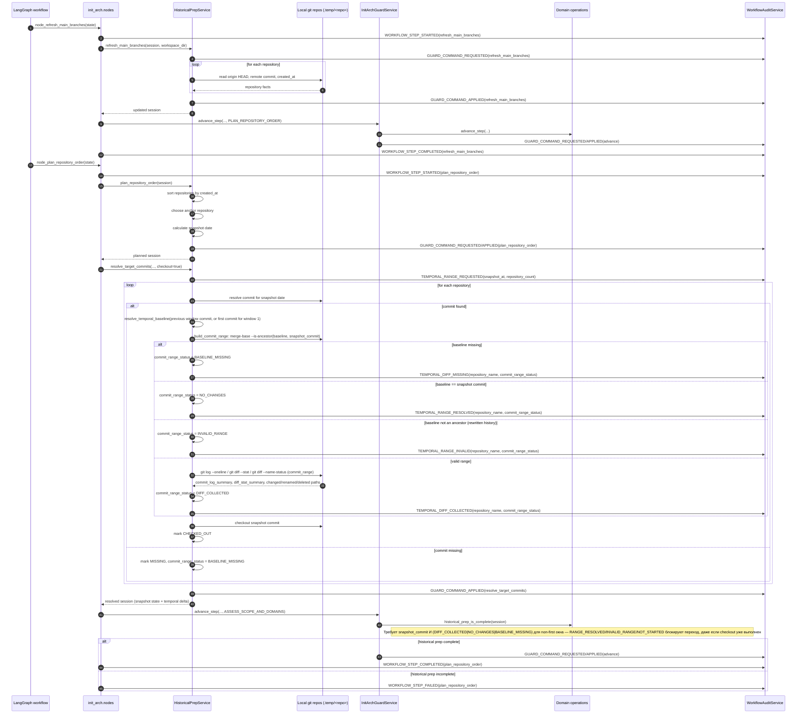
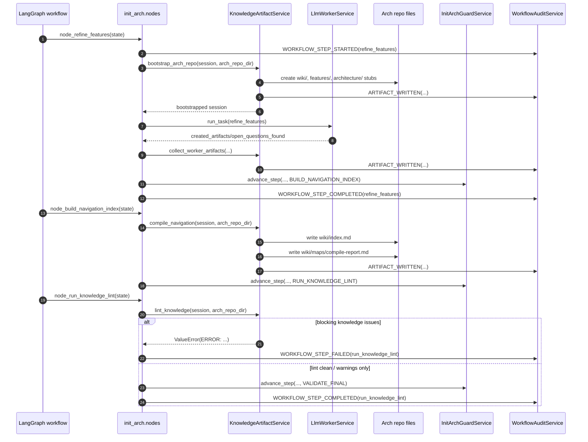
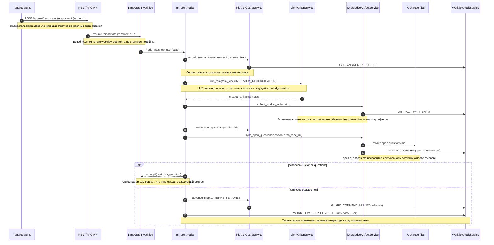
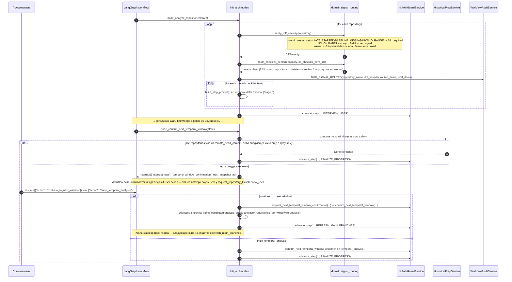

# Init Workflow

## Назначение

`init` workflow запускает первичную инициализацию архитектурной документации по продукту и проводит сервис через полный pipeline `init_arch`: от определения scope и списка репозиториев до knowledge lint и финализации workflow session.

Документ фиксирует текущее состояние backend-реализации в `arch-docs`, включая уже реализованные шаги и известные разрывы с целевым `init-repo-arch-skill`.

## Entrypoints

### Conversation-first REST

- `POST /api/rest/conversations/` создаёт conversation-контейнер для будущих run;
- `GET /api/rest/conversations/{conversation_id}/` возвращает conversation и активный `response`;
- `GET /api/rest/conversations/{conversation_id}/items/` читает persisted timeline items;
- `GET /api/rest/conversations/{conversation_id}/stream/` стримит active response через тот же SSE backend;
- `POST /api/rest/responses/` запускает новый `response` внутри conversation, сейчас поддержан `workflow_type=init_arch`;
- `GET /api/rest/responses/{response_id}/` возвращает status/read-model response, `required_actions` и `terminal_result`;
- `POST /api/rest/responses/{response_id}/actions/` проксирует `cancel`, `resume` и `answer_question` в тот же workflow runtime;
- `workflow_type` уже покрывает `init_arch`, `update_arch` и `query`.

Реализация: [rest/conversations.py](../../app/api/rest/conversations.py), [init_arch_workflow.py](../../app/services/init_arch_workflow.py)

### OpenAI-Compatible Facade

- `GET /v1/models` публикует facade-models `arch-docs-init_arch`, `arch-docs-update_arch`, `arch-docs-query`;
- `POST /v1/responses` запускает те же backend runs через model-to-workflow mapping;
- `GET /v1/responses/{response_id}` возвращает OpenAI-shaped read-model поверх того же runtime;
- `POST /v1/responses/{response_id}/actions` — custom submit-action route (не часть официального OpenAI API) поверх того же `submit_response_action_async()`, что и REST `conversations.py`: поддерживает `cancel`/`answer_question`/`resume`/`confirm_temporal_window` над тем же `response_id`, без отдельного обходного механизма;
- `POST /v1/chat/completions` сейчас покрывает query-only сценарий для OpenAI-compatible chat clients;
- streaming facade не меняет source of truth: conversation timeline и persisted execution dialog остаются внутренними.

Реализация: [openai.py](../../app/api/openai.py)

### MCP

`init_arch` теперь стартует тот же backend workflow runtime, что и HTTP transports, и возвращает workflow envelope (`workflow_id`, `workflow_status`, `current_step_id`, `created_at`), а не stdout legacy CLI prompt-path.

Реализация: [mcp_server.py](../../app/mcp_server.py)

## State Machine

Текущая state machine линейная и собирается через `langgraph`.

```text
define_scope             -> определить scope анализа и инициализировать workflow session
request_repository_list  -> получить список репозиториев, если он не был передан на старте
prepare_temp_workspace   -> подготовить рабочую временную зону под raw analysis
clone_repositories       -> собрать локальные checkout целевых репозиториев
refresh_main_branches    -> прочитать main branch, remote HEAD и created_at по каждому repo
plan_repository_order    -> выбрать anchor repo, рассчитать snapshot date и target commits
assess_scope_and_domains -> определить масштаб анализа и стратегию разбиения на domains
analyze_repositories     -> пройти repository checklist и собрать технические факты
interview_user           -> остановиться на открытых вопросах и дождаться ответа пользователя
refine_features          -> синтезировать и уточнить feature-level knowledge
build_navigation_index   -> собрать навигационные knowledge artifacts и индексы
run_knowledge_lint       -> проверить knowledge layer на структурные проблемы
validate_final           -> выполнить финальную валидацию workflow результата
finalize_progress        -> зафиксировать завершение session и закрыть workflow
done                     -> terminal state
```

Источник шагов: [steps.py](../../app/workflows/init_arch/domain/steps.py)  
Сборка графа: [graph.py](../../app/workflows/init_arch/graph.py)

## Sequence Diagram

Ниже зафиксированы четыре ключевых service-driven участка, уже реализованных в workflow: diff-aware historical prep (snapshot + temporal delta), knowledge pipeline, interview loop после ответа пользователя, и diff signal routing вместе с temporal window confirmation loop-back.









## Компоненты

### API Layer

- принимает transport-запросы через `conversations/responses`;
- response actions резюмируют и отменяют тот же backend runtime, не создавая отдельный workflow-specific transport;
- MCP `init_arch` вызывает тот же service-layer и больше не обходит backend workflow через legacy prompt-path.

Код: [init_arch_workflow.py](../../app/services/init_arch_workflow.py), [rest/conversations.py](../../app/api/rest/conversations.py), [mcp_server.py](../../app/mcp_server.py)

### Workflow Graph

- задаёт маршрут между шагами: линейный для большинства узлов, с одним conditional loop-back;
- выполняет retry до `_MAX_RETRY`;
- отправляет workflow в `handle_error` после исчерпания retry;
- узел `confirm_next_temporal_window` — единственное исключение из линейного маршрута: маршрутизируется кастомным `_route_after_confirm_next_temporal_window()`, который либо зацикливает граф на `refresh_main_branches` для следующего temporal-окна, либо продолжает на `finalize_progress`.

Код: [graph.py](../../app/workflows/init_arch/graph.py)

### Nodes

- являются orchestration-layer для конкретных шагов;
- вызывают guard-service, historical service и LLM worker;
- переводят service results обратно в `InitArchState`.

Код: [nodes.py](../../app/workflows/init_arch/nodes.py)

### Guard Service

- владеет typed guard-операциями;
- делает `advance_step`, repo lifecycle, finalize, validate;
- пишет audit-события guard-уровня.

Код: [guard.py](../../app/workflows/init_arch/guard.py)

### Historical Prep Service

- собирает repository facts;
- планирует snapshot window;
- резолвит target commits и checkout на snapshot;
- дополнительно строит temporal-delta для окна: `resolve_temporal_baseline()`, `build_commit_range()`, `collect_diff_summary()`, `collect_changed_paths()`, `collect_commit_log_summary()` заполняют `commit_range`, `diff_stat_summary`, `commit_log_summary`, `changed_paths`/`renamed_paths`/`deleted_paths` для каждого repository-window;
- extraction сделан range-aware (first-window baseline, `no_changes`, `invalid_range` обрабатываются явно), и с Этапа 4 результат стал обязательным quality gate: `historical_prep_is_complete()` пропускает окно только при `DIFF_COLLECTED`, явном `NO_CHANGES` или `BASELINE_MISSING`, а `RANGE_RESOLVED`/`INVALID_RANGE` блокируют переход к `assess_scope_and_domains`/`analyze_repositories`;
- публикует temporal audit-события (`temporal_range_requested`, `temporal_range_resolved`, `temporal_diff_collected`, `temporal_diff_missing`, `temporal_range_invalid`) для каждого repository-window;
- подготавливает state для historical gate.

## Runtime Hardening

### Timeout и parallelism policy

- `LlmCliService` больше не доверяет безусловно входному `timeout_seconds`: для `init_arch` worker-задач runtime применяет `min(request.timeout_seconds, WORKFLOWS__INIT__MAX_STEP_TIMEOUT_SECONDS)`;
- дефолтный hard cap для шага — `900` секунд; значение можно изменить через `WORKFLOWS__INIT__MAX_STEP_TIMEOUT_SECONDS`;
- параллелизм CLI-агентов по-прежнему ограничивается общим `AgentPool`, который настраивается через `AGENT_POOL_SIZE`; именно этот semaphore является продуктовым bulkhead для тяжёлых analysis/synthesis шагов;
- это означает, что даже при нескольких одновременных `conversation`-запусках сервис держит bounded число внешних Codex/Claude subprocess.

### Workspace layout

- `workspace_dir` остаётся корнем mounted product workspace;
- raw-layer по умолчанию находится в `WORKFLOWS__INIT__RAW_WORKSPACE_SUBDIR=.temp`;
- knowledge/synthesis layer по умолчанию находится в `WORKFLOWS__INIT__ARCH_REPO_DIRNAME=arch-doc`;
- при старте `init_arch` backend валидирует layout и отклоняет конфигурацию, где `arch_repo_dir` попадает внутрь raw-layer;
- prompt для worker теперь явно разводит raw checkout layer и knowledge output layer: `.temp` разрешён только для чтения/checkout, `arch-doc` — только для synthesis-артефактов.

### Audit retention и masking

- persisted `cli_tasks.prompt_text` ограничивается `AUDIT__MAX_PROMPT_CHARS` (default `12000`);
- persisted `task_result` и `stdout_output` ограничиваются `AUDIT__MAX_OUTPUT_CHARS` (default `16000`);
- persisted `task_error` и `stderr_output` ограничиваются `AUDIT__MAX_ERROR_CHARS` (default `8000`);
- перед записью в БД runtime маскирует bearer tokens и inline-секреты вида `*_TOKEN=...`, `*_SECRET=...`, `*_PASSWORD=...`, `*_API_KEY=...`;
- усечение применяется уже после masking, с сохранением целого маркера `[REDACTED]`, чтобы forensic trail оставался читаемым.

## Deployment Notes

### Docker Compose env vars

`arch-docs/docker-compose.yml` теперь публикует и документирует минимальный hardening-набор:

- `AGENT_POOL_SIZE` — верхняя граница параллельных CLI worker subprocess;
- `INIT_ARCH_MAX_STEP_TIMEOUT_SECONDS` — hard cap для отдельных шагов `init_arch`;
- `INIT_ARCH_RAW_WORKSPACE_SUBDIR` — имя raw-layer каталога внутри workspace;
- `INIT_ARCH_ARCH_REPO_DIRNAME` — имя synthesis/knowledge каталога внутри workspace;
- `AUDIT_MAX_PROMPT_CHARS`, `AUDIT_MAX_OUTPUT_CHARS`, `AUDIT_MAX_ERROR_CHARS` — лимиты persisted audit payload.

### Volume layout

- `workspace:/workspace` — общий volume с исходным продуктовым repo и generated `arch-doc/`;
- `codex-auth:/home/appuser/.codex` и `claude-auth:/home/appuser/.claude` — отдельные volumes под auth state CLI-агентов;
- `./skills:/app/skills:ro` — read-only skill bundle, не смешанный с runtime workspace;
- PostgreSQL хранит execution dialog и task/workflow metadata независимо от volumes с checkout-данными.

Код: [historical.py](../../app/workflows/init_arch/historical.py)

### Knowledge Artifact Service

- bootstrap-ит `features/`, `architecture/`, `wiki/` и базовые knowledge files;
- bootstrap-ит из vendored templates также одиночные `architecture/*.md` артефакты (`hld`, `security`, `risks`, `tech-stack`, `roles-and-permissions`, `domain-entities`, `integrations-overview`, `constraints`, `requirements`) и `architecture/landscape.yaml`;
- использует vendored templates из `app/workflows/shared_assets/knowledge_base/` через общий asset loader;
- синхронизирует `open-questions.md` из typed `session.open_questions` до и после interview loop;
- компилирует `wiki/index.md` и `wiki/maps/compile-report.md`;
- запускает knowledge lint и публикует `artifact_written` audit events;
- обновляет `session.artifacts` как typed artifact registry.

Код: [knowledge.py](../../app/workflows/init_arch/knowledge.py), [knowledge_runtime.py](../../app/workflows/init_arch/knowledge_runtime.py)

### Domain Layer

- определяет `StepId`, `WorkflowSessionRecord`, typed repository state;
- проверяет required previous steps;
- валидирует `historical_prep_is_complete()` перед дальнейшим анализом.

Код: [models.py](../../app/workflows/init_arch/domain/models.py), [operations.py](../../app/workflows/init_arch/domain/operations.py)

### Audit Layer

- накапливает `WorkflowEventRecord` по `session_id`;
- асинхронно дублирует audit events в persisted `conversation_items`;
- используется `nodes`, `guard` и worker services.

Код: [audit.py](../../app/workflows/init_arch/audit.py)

## Persisted Runtime Slice

Текущая реализация больше не зависит только от in-memory registries:

- `workflow_runs` хранит сериализованный `WorkflowRecord`, включая `session`, `pending_interrupt`, текущий step и terminal status;
- `conversations` вводит future-compatible контейнер для workflow history;
- `conversation_items` хранит timeline ключевых service transitions и audit events;
- `required_actions` хранит открытые вопросы и другие pending interrupts, пригодные для resume после рестарта;
- `cli_tasks` теперь сохраняет не только `stdout`, но и `stderr` плюс `exit_code`, чтобы worker execution был воспроизводимее.

Что это даёт уже сейчас:

- `status`, `resume` и `cancel` могут восстанавливать workflow из БД, если процесс пережил потерю runtime-cache;
- на startup сервис переводит зависшие `running` workflow-runs в `failed` с причиной `Service restarted`, а не теряет их бесследно;
- interrupt state и open questions больше не живут только в памяти.

Ограничение текущего среза:

- `workflow_registry` пока остаётся runtime-cache поверх БД, а не полностью убран;
- `llm_messages` и causal links между conversation items остаются отдельным хвостом;
- facade-level submit actions для OpenAI-compatible long-running clients ещё не собраны.

## State И Артефакты

Основной runtime state:

- `InitArchState`
- `WorkflowSessionRecord`
- `RepositoryExecution`
- `HistoricalAnalysisState`
- `OpenQuestionRecord`
- `ArtifactRecord`

Назначение сущностей:

- `InitArchState` — transport/runtime envelope для конкретного прогона `langgraph`: хранит `session`, пути workspace/arch-repo, engine, timeout, retry state и последние результаты guard/worker вызовов.
- `WorkflowSessionRecord` — canonical service-owned состояние workflow: текущий шаг, завершённые шаги, список репозиториев, historical context, knowledge artifacts и open questions.
- `RepositoryExecution` — состояние анализа одного репозитория: его metadata, выбранный snapshot commit, strategy/domain breakdown, progress по checklist item-ам и (с этапа 2-3) typed temporal-delta текущего окна.
- `HistoricalAnalysisState` — общий temporal context workflow: anchor repo, snapshot date, порядок обхода репозиториев и (с этапа 2) previous snapshot baseline для range-aware timeline.
- `OpenQuestionRecord` — один вопрос, который сервис держит в interview loop, включая статус, связанные репозитории, target artifacts и ответ пользователя.
- `ArtifactRecord` — запись об артефакте knowledge-слоя с типом, трассировкой источников и последним шагом, который его обновлял.

Текущее состояние backend после этапов 2-3:

- `HistoricalPrepService.resolve_target_commits()` уже совмещает snapshot resolution и первичный temporal-delta сбор: для каждого repository-window сервис пытается определить baseline commit, построить `commit_range` и собрать summaries/path lists.
- Для first window baseline сначала ищется как первый commit репозитория; если git-history локально недоступна, состояние фиксируется как явный `baseline_missing`, а не как неявный пустой range.
- Для subsequent windows baseline берётся из `previous_analysis_target_commit`; при переписанной истории или разрыве ancestry сервис помечает окно как `invalid_range`.

Ключевые поля session state:

- `current_step`
- `completed_steps`
- `repositories[*].created_at`
- `repositories[*].main_branch`
- `repositories[*].remote_head_commit`
- `repositories[*].analysis_target_date`
- `repositories[*].analysis_target_commit`
- `repositories[*].analysis_target_commit_status`
- `repositories[*].previous_analysis_target_commit`
- `repositories[*].window_start_commit`
- `repositories[*].window_end_commit`
- `repositories[*].commit_range`
- `repositories[*].commit_range_status`
- `repositories[*].diff_stat_summary`
- `repositories[*].commit_log_summary`
- `repositories[*].changed_paths`
- `repositories[*].renamed_paths`
- `repositories[*].deleted_paths`
- `repositories[*].temporal_delta_note`
- `historical_analysis.anchor_repository_name`
- `historical_analysis.previous_snapshot_at`
- `historical_analysis.current_snapshot_at`
- `historical_analysis.ordered_repository_names`
- `artifacts[*].artifact_path`
- `artifacts[*].artifact_kind`
- `artifacts[*].source_refs`
- `artifacts[*].last_updated_step`

Смысл этих полей:

- `current_step` и `completed_steps` определяют, где именно находится orchestrator и какие transition checks уже можно проходить без повторного выполнения шагов.
- `repositories[*].created_at`, `main_branch`, `remote_head_commit`, `analysis_target_date`, `analysis_target_commit`, `analysis_target_commit_status` нужны для historical prep и для доказуемого выбора snapshot состояния каждого repo.
- `repositories[*].previous_analysis_target_commit`, `window_start_commit`, `window_end_commit`, `commit_range`, `commit_range_status`, `diff_stat_summary`, `commit_log_summary`, `changed_paths`, `renamed_paths`, `deleted_paths`, `temporal_delta_note` образуют typed temporal-delta слой для конкретного repository-window и дают workflow возможность валидировать range-aware prep до запуска содержательного анализа.
- `historical_analysis.anchor_repository_name`, `previous_snapshot_at`, `current_snapshot_at`, `ordered_repository_names` фиксируют общий temporal baseline, от которого зависит порядок анализа и quality gate перед domain/scope шагами.
- `artifacts[*].artifact_path`, `artifact_kind`, `source_refs`, `last_updated_step` образуют artifact registry: сервис знает, какие knowledge-документы уже были созданы, чем они являются и из какого шага/источника появились.

### Commit Range Status

- `not_started` — temporal delta для окна ещё не строилась; допустимо только до range-aware prep.
- `baseline_missing` — snapshot commit найден, но baseline предыдущего окна явно отсутствует и это зафиксировано как допустимый special-case.
- `range_resolved` — start/end commits и `commit_range` определены, но diff summaries ещё не собраны.
- `diff_collected` — range и основные summaries (`diff_stat_summary`, `commit_log_summary`, path lists) уже собраны.
- `no_changes` — диапазон окна вырожденный, новых commit нет, но temporal prep выполнен осознанно.
- `invalid_range` — сервис определил inconsistent или unusable range; downstream historical gate не должен пропускать такой repo.

## Temporal Contract

Ниже зафиксирован нормативный contract для diff-aware temporal analysis, который обязателен для следующих этапов развития `init_arch`, даже если текущая backend-реализация ещё не закрывает его полностью.

### Glossary

- `snapshot_date` — дата текущего временного окна, для которой строится состояние кода.
- `snapshot_commit` — commit конкретного репозитория, выбранный не позже `snapshot_date`.
- `previous_snapshot_commit` — commit того же репозитория из предыдущего завершённого окна.
- `window_start_commit` — baseline commit текущего окна; обычно совпадает с `previous_snapshot_commit`.
- `window_end_commit` — верхняя граница окна; должен совпадать с `snapshot_commit`.
- `commit_range` — нормализованное представление интервала изменений между `window_start_commit` и `window_end_commit`.
- `diff_stat_summary` — summary `git diff --stat` для текущего окна.
- `changed_paths` — нормализованный список путей из `git diff --name-status`, включая rename/delete semantics.
- `commit_log_summary` — summary commit history по `git log` для текущего окна.

### Current Backend Coverage

- `resolve_target_commits()` уже заполняет `previous_analysis_target_commit`, `window_start_commit`, `window_end_commit`, `commit_range`, `diff_stat_summary`, `commit_log_summary`, `changed_paths`, `renamed_paths`, `deleted_paths`, `temporal_delta_note`.
- Stage 3 закрыт: `HistoricalPrepService` реализует `resolve_temporal_baseline()`, `build_commit_range()`, `collect_diff_summary()`, `collect_changed_paths()`, `collect_commit_log_summary()` и корректно обрабатывает edge-cases — first-window baseline (может деградировать в `baseline_missing`), одинаковые start/end commits (`no_changes`), invalid ancestry (`invalid_range`).
- Stage 4 закрыт: `historical_prep_is_complete()` требует для non-first window один из статусов `DIFF_COLLECTED`, `NO_CHANGES` или `BASELINE_MISSING`; транзитный `RANGE_RESOLVED` (диапазон построен, diff ещё не собран) и `INVALID_RANGE` блокируют переход к `assess_scope_and_domains`/`analyze_repositories`.
- Для `no_changes` сервис допускает вырожденное окно без diff payload — это первоклассный валидный статус, а не проваленный gate (до Stage 4 gate ошибочно требовал непустой `commit_range` даже для `no_changes`, это исправлено).
- `resolve_target_commits()` публикует typed audit-события через `_record_temporal_delta_event()`: `temporal_range_requested` (старт окна), `temporal_diff_collected`, `temporal_range_resolved` (no-changes), `temporal_diff_missing` (baseline missing), `temporal_range_invalid`.

### Window Rules

- Любое temporal окно после первого рассматривается как пара: `state at snapshot` плюс `changes since previous snapshot`.
- Для первого окна допустим special-case baseline:
  - либо `repo created_at baseline`;
  - либо первый доступный commit в истории;
  - этот случай должен быть отражён явно, а не скрыт пустым range.
- Репозиторий может не иметь новых commit внутри текущего окна. Это не ошибка:
  - `snapshot_commit` всё равно выбирается как последний commit не позже `snapshot_date`;
  - если он совпадает с `previous_snapshot_commit`, temporal delta для окна должна маркироваться как `no_changes`;
  - такой repo остаётся валидным участником общего product snapshot даже если другие repos менялись недавно.
- Репозиторий может также временно не иметь commit на раннем окне, если он появился позже общего `snapshot_date`; это должно давать явный `missing`/`baseline_missing` статус для этого repo, но не должно ломать весь workflow.
- Если история неполная, baseline недоступен или ancestry не строится корректно, workflow обязан зафиксировать это как отдельный статус temporal delta, а не считать prep успешным молча.
- Empty/degenerate delta допустима только как явно помеченный случай:
  - `window_start_commit == window_end_commit`;
  - либо `baseline missing` для первого окна;
  - либо подтверждённый `no changes`.

### Downstream Contract

- `assess_scope_and_domains` и `analyze_repositories` не должны считать historical prep завершённым, если подготовлен только checkout на дату без delta-context.
- Checkout snapshot-state остаётся обязательным, но сам по себе он недостаточен для diff-aware temporal reasoning.
- Отсутствие новых commit в отдельном репозитории внутри окна не должно считаться failure condition: для такого repo допустим stable snapshot с `no_changes`.
- Target quality gate для окна должен подтверждать не только `snapshot_commit`, но и наличие одного из состояний:
  - валидный `commit_range` с diff metadata;
  - явно зафиксированный `baseline_missing`;
  - явно зафиксированный `no_changes`.
- `HistoricalPrepService` строит и хранит `commit_range`, `diff_stat_summary`, `changed_paths`, `commit_log_summary` (Stage 3), и `historical_prep_is_complete()` теперь валидирует их как обязательное условие готовности окна (Stage 4).

### Worker Prompt Enrichment (Stage 6)

Temporal delta текущего окна больше не остаётся только в domain state — она прокидывается в промпт worker'а на каждом шаге, а не только на `analyze_repositories`:

- `build_step_prompt()` (`app/workflows/init_arch/prompts.py`) для активного репозитория (`analysis_status == "in_progress"`) рендерит секцию `# Temporal delta текущего окна`: `snapshot date`, `snapshot commit`, `window_start_commit`/`window_end_commit`, `commit_range`, `commit_range_status`, commit log summary, diff stat summary и списки `changed_paths`/`renamed_paths`/`deleted_paths`;
- для нетривиальных статусов добавлена explanatory-заметка прямо в промпт: `not_started` — delta ещё не построена, `no_changes` — изменений не было, `baseline_missing`/`invalid_range` — явное указание не полагаться на diff и работать только со snapshot state;
- context разделён на compact и expanded уровни: обычные шаги получают списки путей, обрезанные до 10 записей (`_MAX_COMPACT_CHANGED_PATHS`), `analyze_repositories` получает полный список без обрезки — там worker реально приоритизирует анализ по diff;
- секция `# Инструкции` явно требует сначала изучить temporal delta (commit range/log/diff stat), и только затем при необходимости читать итоговое состояние файлов в raw checkout-слое;
- `LlmTaskResult` (`app/workflows/init_arch/domain/models.py`) расширен полями `diff_based_findings: list[str]` и `snapshot_based_findings: list[str]`; JSON-контракт в промпте и парсинг в `LlmCliService.run_task()` (`app/services/task_runner.py`) обновлены симметрично, так что worker может явно разделить, какие выводы опираются на diff, а какие на snapshot state.

### Diff Signal Routing (Stage 7)

Temporal delta теперь не только видна worker'у (Stage 6), но и используется сервисом для приоритизации глубины анализа внутри `analyze_repositories`. Реализовано в новом domain-модуле `app/workflows/init_arch/domain/signal_routing.py` (без зависимости от `prompts.py` — presentation-слой не нужен pure business-логике маршрутизации):

- `classify_diff_severity(repository) -> DiffSeverity` классифицирует repository-window по уже существующим typed-полям (Stage 2-4), не вводя новый источник фактов:
  - `not_started` / `baseline_missing` / `invalid_range` -> `full_required` — недостаточно сигнала, чтобы сузить анализ;
  - `no_changes`, либо `diff_collected` с пустым `changed_paths`/`renamed_paths`/`deleted_paths` -> `no_signal`;
  - иначе считается число уникальных top-level директорий по объединению `changed_paths`+`renamed_paths`+`deleted_paths`: до 3 включительно -> `local`, больше -> `broad`.
- `route_checklist_items(repository, *, all_checklist_item_ids) -> list[str]` — три ветки:
  - `full_required`/`broad` -> полный чеклист без исключений (temporal diff не заменяет целостный анализ);
  - `no_signal` -> единственный routed item `repository_consistency_review` — analysis сведён к подтверждению отсутствия изменений;
  - `local` -> категории из lightweight glob-таблицы `_PATH_SIGNAL_CATEGORIES` (адаптация fallback-таблицы `update-repo-arch-skill/references/checklist-signal-routing.md`: `api/`/`routers/`/`controllers/` -> `entrypoints_and_interfaces`, `serializers/`/`schemas/`/`dto/` -> `contracts_and_schemas`, `migrations/`/`models/` -> `data_and_storage`, `auth/`/`rbac/` -> `roles_and_permissions_updates`+`security_and_auth_updates` и т.д.), плюс всегда включённые `architecture_artifact_updates` и `repository_consistency_review`; порядок результата совпадает с порядком `all_checklist_item_ids`.
- `nodes.py::node_analyze_repositories` вызывает `route_checklist_items()` перед циклом по чеклисту репозитория и итерирует только по routed-подмножеству вместо всех 20 категорий безусловно; per-repository routing-решение публикуется как аудит-событие `diff_signal_routed` (`diff_severity`, `routed_items`, `total_items`).
- Инвариант "temporal diff не заменяет целостный анализ" закреплён кодом: `historical_prep_is_complete()` (Stage 4) по-прежнему блокирует переход к `analyze_repositories` без построенной delta, а `guard_service.complete_repository()` не требует полноты `checklist_items_completed` — сокращённый routing не может тихо пометить репозиторий "полностью проанализированным".
- Обратная совместимость: default `commit_range_status = NOT_STARTED` маппится в `full_required` -> полный чеклист, поэтому существующие сценарии без построенной temporal-delta не меняют поведение.

### Legacy Interop Tooling (Stage 8)

Помимо service-owned `init_arch` (этот документ), в `init-repo-arch-skill/scripts/analysis_guard/` живёт отдельный
standalone Python CLI (`analysis_guard.py`) — не связанный импортами с `arch-docs`, со своей JSON/YAML progress-моделью.
Он используется, когда skill исполняется вручную агентом (Claude Code/Codex) вне backend workflow runtime. Diff-aware
temporal contract синхронизирован и туда:

- `scripts/analysis_guard/models.py`: `default_historical_analysis()`/`normalize_repository()` несут те же temporal-delta
  поля, что и `arch-docs`-модель (Stage 2) — `previous_snapshot_at` на уровне `historical_analysis`; `previous_analysis_target_commit`,
  `window_start_commit`, `window_end_commit`, `commit_range`, `commit_range_status`, `diff_stat_summary`, `commit_log_summary`,
  `changed_paths`/`renamed_paths`/`deleted_paths`, `temporal_delta_note` на уровне репозитория.
- `scripts/analysis_guard/commands.py`: `timeline --resolve-local` строит `_build_temporal_delta()` сразу после резолва
  `analysis_target_commit` (независимо от `--checkout`) — те же четыре исхода, что и `HistoricalPrepService` (Stage 3):
  `baseline_missing` (baseline недоступен, first-window fallback — первый commit на `main_branch`), `no_changes`
  (`window_start_commit == window_end_commit`), `invalid_range` (`window_start_commit` не предок `window_end_commit` —
  переписанная история/force-push, через `git merge-base --is-ancestor`), `diff_collected` (`git log --oneline` +
  `git diff --stat` + `git diff --name-status` для диапазона). `timeline --advance-window` переносит `current_snapshot_at`
  в `previous_snapshot_at`, сохраняет только что resolved commit как `previous_analysis_target_commit` следующего окна
  и сбрасывает temporal-delta поля через `_reset_temporal_delta()` (тот же reset — и в `timeline --plan`).
- `scripts/analysis_guard/validation.py`: `commit_range_status` валидируется против того же словаря значений, что и
  `CommitRangeStatus` в `arch-docs`; новый gate — `analyze_repositories` не может быть `completed`, пока для каждого
  repo (кроме `missing_on_date`) `commit_range_status` не в `{diff_collected, no_changes, baseline_missing}` — тот же
  инвариант "diff обязателен как quality gate", что и Stage 4 в service-owned workflow.
- `scripts/analysis_guard/status.py`: `status` печатает `historical_previous_snapshot_at` и per-repository строку
  `temporal_delta: range_status=... range=... changed=N renamed=N deleted=N`.
- `assets/repo-initialization-progress-template.yaml` и `SKILL.md` обновлены синхронно с реализацией.
- Обратная совместимость: `normalize_repository()` подставляет `commit_range_status="not_started"` через `setdefault`,
  так что старые progress-файлы без temporal-delta полей продолжают проходить `validate`/`status` — но, как и требовал
  план, ценой нового инварианта: **завершить** `analyze_repositories` для repo без построенной delta теперь нельзя.
- Регрессии: `init-repo-arch-skill/tests/test_analysis_guard_knowledge.py` — 13 тестов, включая end-to-end двухоконный
  сценарий (`no_changes` на первом окне, `diff_collected` на втором после `--advance-window`), gate-тест на
  `invalid_range`/недостроенную delta и unit-тесты на `_build_temporal_delta()` (`baseline_missing`, `invalid_range`
  через реальный `git commit --amend`, happy path).

Progress file path по-прежнему прокидывается в state как compatibility artifact:

- `arch-doc/repo-initialization-progress.yaml`

Но canonical owner workflow state уже должен считаться сервисный `session`.

## Pause / Resume Semantics

Сейчас workflow умеет делать interrupt в двух местах:

- `request_repository_list` — если список репозиториев не передан;
- `interview_user` — если есть открытый пользовательский вопрос.

Resume semantics:

- API читает `pending_interrupt` из `WorkflowRecord` или восстанавливает его из persisted `workflow_runs`;
- по `interrupt_type` строит resume payload;
- повторно запускает `graph.astream(...)` с тем же `thread_id`;
- для `user_question` доступен и generic `resume`, и question-scoped endpoint `questions/{question_id}/answer/`;
- после resume на `interview_user` сервис сам делает post-answer cycle: `record_user_answer` -> worker reconciliation -> artifact registration -> `close_user_question` -> sync `open-questions.md`.

Ограничение текущей реализации:

- open-question lifecycle уже персистится в `required_actions`, но полноценная conversation-first dialogue model с несколькими runs на один conversation ещё не собрана.

### Temporal Window Confirmation (Stage 5)

Третий вид паузы, отдельно от `request_repository_list`/`interview_user`: обязательное подтверждение пользователя перед переходом к следующему temporal-окну. Реализован как настоящий loop-back узел графа, а не только domain-контракт:

- `NextWindowConfirmationStatus` (`none`/`pending`/`confirmed`/`stopped`) и поля `HistoricalAnalysisState.awaiting_window_confirmation`, `last_completed_snapshot_at`, `next_snapshot_at`, `next_window_confirmation_status` фиксируют состояние ожидания;
- `request_next_temporal_window_confirmation(session, *, next_snapshot_at)` переводит `session.status` в `WAITING_FOR_USER` и помечает `next_window_confirmation_status = pending`;
- `confirm_next_temporal_window(session, *, action)` принимает `continue_to_next_window` (продвигает `previous_snapshot_at`/`current_snapshot_at`/`window_index`, пополняет `completed_snapshot_dates`, статус `confirmed`) или `finish_temporal_analysis` (снимает флаг ожидания без продвижения окна, статус `stopped`); вызов без активного pending-подтверждения — `DomainOperationError`;
- новый `StepId.CONFIRM_NEXT_TEMPORAL_WINDOW` вставлен между `VALIDATE_FINAL` и `FINALIZE_PROGRESS`; `HistoricalPrepService.compute_next_window(session, *, today)` определяет terminal-условие (все repositories уже на `remote_head_commit`, либо следующее окно ещё в будущем) — тогда узел сразу advance-ит к `FINALIZE_PROGRESS` без паузы;
- если окно не terminal, `node_confirm_next_temporal_window` вызывает `interrupt({"interrupt_type": "temporal_window_confirmation", ...})` (та же семантика паузы, что и у `request_repository_list`/`interview_user`); на resume `action` (`continue_to_next_window`/`finish_temporal_analysis`) прогоняется через `guard.request_next_temporal_window()` -> `guard.confirm_next_temporal_window()`;
- при `continue_to_next_window` per-window analysis progress (`checklist_items_completed`, `analysis_status`) у всех repositories сбрасывается перед advance к `REFRESH_MAIN_BRANCHES` — осознанное решение: полный re-run checklist на новое окно, а не накопительный прогресс, до появления diff-based signal routing (Stage 7);
- граф (`app/workflows/init_arch/graph.py`) маршрутизирует `confirm_next_temporal_window` кастомным `_route_after_confirm_next_temporal_window()` (не generic `_route_after_node()`): loop-back на `refresh_main_branches` при `continue`, иначе на `finalize_progress`.

Transport-контракт для этого подтверждения полностью подключён:

- `build_resume_value()` в `services/init_arch_workflow.py` резолвит `interrupt_type == "temporal_window_confirmation"` в `{"action": value}`, симметрично `user_input`/`user_question`;
- `confirm_init_arch_temporal_window(workflow_id, *, action)` — dedicated service-функция (mirror `answer_init_arch_question()`): проверяет `workflow_status is INTERRUPTED` и `pending_interrupt.interrupt_type == "temporal_window_confirmation"`, валидирует `action`, планирует `schedule_resume(...)`;
- `submit_response_action_async()` получил ветку `action_type == "confirm_temporal_window"` (требует `value`) — тот же generic dispatcher, которым уже пользуются `cancel`/`answer_question`/`resume`;
- REST `POST /responses/{response_id}/actions/` в `api/rest/conversations.py` требует нуля правок — `ResponseActionRequest` уже был достаточно generic (`action_type`, `question_id`, `answer`, `field`, `value`), новое действие проходит через существующий pass-through;
- `api/openai.py` получил новый route `POST /v1/responses/{response_id}/actions` (`OpenAIResponseActionRequest`, то же generic-поле множество) поверх того же `submit_response_action_async()` — то самое "действие над тем же `response_id`/workflow-run, без отдельного обходного механизма" из требований этапа. Побочный эффект: закрывает Known Gap "OpenAI facade не экспонирует submit actions" для *всех* interrupt-типов, а не только для temporal-окон.

Открытый gap (не закрыт этим этапом):

- реальный E2E-прогон через LangGraph checkpointer (Postgres) не выполнялся; interrupt/resume-семантика нового узла проверена только unit-тестами по аналогии с уже существующими паттернами, не через живой checkpointed run.

## Quality Gates

### Before `assess_scope_and_domains`

Требуется завершённый historical prep:

- выбран `anchor_repository_name`;
- задан `anchor_created_at`;
- задан `current_snapshot_at`;
- `ordered_repository_names` совпадает с порядком по `created_at`;
- для всех репозиториев выставлен `analysis_target_date`;
- все target commit statuses входят в `{resolved, checked_out, missing}`.

Код: [operations.py](../../app/workflows/init_arch/domain/operations.py)

### Target Gate For Diff-Aware Windows

Для temporal-diff режима этого недостаточно. С Stage 4 gate дополнительно требует (реализовано в `_repository_temporal_window_is_valid()`):

- вычисленный `window_end_commit`, совпадающий с `snapshot_commit`;
- `window_start_commit` или явно зафиксированный `baseline_missing`;
- `commit_range` для непустого окна и собранные `diff_stat_summary`, `changed_paths`, `commit_log_summary` (статус `commit_range_status == DIFF_COLLECTED`);
- либо явно помеченный `no_changes` (пустой `commit_range` — легитимный, а не проваленный случай).

Транзитный `RANGE_RESOLVED` (диапазон построен, diff ещё не собран) и `INVALID_RANGE` не проходят gate: `historical_prep_is_complete()` возвращает `False`, `advance_step()` кидает `DomainOperationError`, workflow не переходит к `assess_scope_and_domains`/`analyze_repositories`, даже если checkout уже выполнен.

### Step transition checks

Каждый шаг проверяет:

- `required_previous_steps`;
- retry budget;
- наличие `step_error`.

### Knowledge Pipeline Gates

После `refine_features` сервис должен иметь bootstrap-артефакты knowledge-слоя хотя бы для:

- `features-index.md`
- `glossary.md`
- `open-questions.md`
- `architecture/hld.md`
- `architecture/security.md`
- `architecture/risks.md`
- `architecture/tech-stack.md`
- `architecture/roles-and-permissions.md`
- `architecture/domain-entities.md`
- `architecture/integrations-overview.md`
- `architecture/constraints.md`
- `architecture/requirements.md`
- `architecture/landscape.yaml`
- `wiki/index.md`
- `wiki/log.md`
- `wiki/maps/compile-report.md`

Перед переходом за `run_knowledge_lint`:

- `wiki/index.md` и `wiki/maps/compile-report.md` должны быть собраны compile-шагом;
- blocking `ERROR:` из knowledge lint недопустимы;
- warnings допустимы, но фиксируются в lint summary и остаются follow-up.

**В процессе:** `app/workflows/init_arch/architecture_lint.py` (см. план
[2026-07-13-architecture-artifact-lint.md](../spec/2026-07-13-architecture-artifact-lint.md))
уже покрывает structural lint для:

- 9 одиночных markdown-артефактов в `architecture/*` (`hld.md`, `security.md`, `risks.md` и др.);
- опционального `AGENTS.md`, если файл уже создан;
- каждого markdown-файла в `architecture/integrations/`;
- каждого markdown-файла в `features/`.

Отдельно модуль уже валидирует контракты в `architecture/contracts/`:

- `*-sync.yml` проверяются как OpenAPI через `openapi-spec-validator`;
- `*-async.yml` проверяются как AsyncAPI 2.6.0 через локально вендоренную JSON Schema и `jsonschema`;
- ошибки YAML, отсутствие верхнеуровневого `openapi`/`asyncapi` и schema violations конвертируются в `ERROR:` issues того же формата, что и остальные проверки.

Также модуль уже проверяет `architecture/storage/*.yml` по минимальной схеме шаблона:

- каждый файл должен быть валидным YAML;
- на верхнем уровне обязателен mapping `storage`;
- внутри `storage` обязателен непустой `type`;
- нарушения конвертируются в `ERROR:` issues, совместимые с остальными lint-проверками.

Также модуль уже проверяет согласованность commit между обзорным и детальным слоями структуры:

- из `architecture/landscape.yaml` читаются `entities.services[*].repository_state.head_commit`;
- для каждого сервиса с `id` и `head_commit` ожидается файл `architecture/structure/<service>.yml`;
- если structure-файл отсутствует, это конвертируется в blocking `ERROR:`;
- если `repo_structure_map.analyzed_commit` в structure-файле не совпадает с `head_commit` из landscape, модуль репортит явную ошибку рассинхронизации.

Также модуль уже детектирует residue от bootstrap-шаблонов в synthesis-слое:

- область действия ограничена только bootstrap-target артефактами с предсказуемым именем файла: 9 одиночных `architecture/*.md`, `glossary.md`, `features-index.md`, `open-questions.md`, `architecture/landscape.yaml`;
- известные `<...>` плейсхолдеры извлекаются программно из тех же template-файлов в `shared_assets/knowledge_base`, а не дублируются вручную;
- любые `<!-- ... -->` HTML-комментарии считаются служебным residue и тоже репортятся как `ERROR:`;
- проверка не мутирует файлы и не пытается автоматически чистить шаблонный мусор: worker обязан убрать его сам до прохождения gate.

Модуль самодостаточен, покрыт таргетными тестами и уже вызывается из
`run_knowledge_lint()`. Это означает, что `ERROR:` из `architecture_lint.py`
теперь входят в тот же blocking quality gate перед переходом к `validate_final`,
что и остальные ошибки knowledge lint.

## Audit / Events

Сейчас используются typed event categories:

- `workflow_step_started`
- `workflow_step_completed`
- `workflow_step_failed`
- `guard_command_requested`
- `guard_command_applied`
- `llm_task_requested`
- `llm_task_completed`
- `llm_task_failed`
- `user_question_opened`
- `user_answer_recorded`
- `artifact_written`
- `artifact_rejected`
- `temporal_range_requested`
- `temporal_range_resolved`
- `temporal_diff_collected`
- `temporal_diff_missing`
- `temporal_range_invalid`
- `diff_signal_routed`

Назначение событий:

- `workflow_step_started` — orchestrator начал выполнение конкретного workflow step; обычно эмитится из `nodes.py` перед основной логикой шага.
- `workflow_step_completed` — шаг успешно завершён и сервис подтвердил возможность перехода дальше.
- `workflow_step_failed` — шаг завершился ошибкой; событие фиксирует failure на уровне orchestration, даже если причина пришла из guard, worker или knowledge runtime.
- `guard_command_requested` — сервис инициировал guard/domain-операцию, например `advance`, `validate`, `record_user_answer`, `repo_start`.
- `guard_command_applied` — guard/domain-операция успешно применила изменение к session state или подтвердила успешное выполнение.
- `llm_task_requested` — orchestrator отправил worker-задачу в CLI LLM с конкретным `task_kind`, prompt и context.
- `llm_task_completed` — worker вернул успешный результат, который сервис смог распарсить и принять в обработку.
- `llm_task_failed` — worker завершился ошибкой, невалидным output или иным failure до успешного принятия результата сервисом.
- `user_question_opened` — сервис зарегистрировал новый open question, который должен быть показан пользователю в interview loop.
- `user_answer_recorded` — ответ пользователя принят сервисом и записан в session state как часть interview lifecycle.
- `artifact_written` — сервис или worker создали/обновили knowledge artifact, и это изменение зафиксировано в artifact registry.
- `artifact_rejected` — сервис отклонил candidate artifact или результат worker reconciliation; сейчас этот тип уже зарезервирован в модели событий, но используется ограниченно.
- `temporal_range_requested` — `HistoricalPrepService.resolve_target_commits()` начал построение temporal-delta для окна (`snapshot_at`, число репозиториев); эмитится один раз на прогон окна.
- `temporal_range_resolved` — для конкретного repository диапазон построен, но окно оказалось вырожденным (`commit_range_status == NO_CHANGES`): новых commit с прошлого snapshot нет.
- `temporal_diff_collected` — для repository собран полноценный diff (`commit_range`, `diff_stat_summary`, `commit_log_summary`, `changed_paths`); `commit_range_status == DIFF_COLLECTED`.
- `temporal_diff_missing` — baseline commit недоступен (`commit_range_status == BASELINE_MISSING`): либо это первое окно без истории, либо repository ещё не существовал на дату предыдущего snapshot, либо commit на текущую snapshot-дату вообще не найден.
- `temporal_range_invalid` — `commit_range_status == INVALID_RANGE`: `window_start_commit` не является предком `window_end_commit` (переписанная история, force-push, rebase); окно не считается готовым.
- `diff_signal_routed` — для repository внутри `analyze_repositories` зафиксировано routing-решение по `DiffSeverity` (`diff_severity`, `routed_items`, `total_items` в payload); эмитится один раз на repository-window перед циклом по чеклисту, из `nodes.py::node_analyze_repositories`.

Практический смысл групп:

- `workflow_step_*` — high-level orchestration timeline.
- `guard_command_*` — изменения service-owned state machine.
- `llm_task_*` — граница между orchestrator и worker.
- `user_*` — lifecycle пользовательского интервью.
- `artifact_*` — изменения knowledge-слоя.
- `temporal_*` — построение range/diff temporal-delta для repository-window и его gate-статус; эмитятся из `HistoricalPrepService._record_temporal_delta_event()`.
- `diff_signal_routed` — приоритизация глубины анализа внутри `analyze_repositories` по diff severity (Stage 7).

События больше не ограничены только memory-backed runtime: transport читает persisted `conversation_items`, а workflow step transitions и artifact events дополнительно пишутся в специализированные таблицы.

Transport-level terminal states:

- `running`
- `interrupted`
- `success`
- `failed`
- `cancelled`

## Current Implementation Status

Уже реализовано:

- typed workflow state и step model;
- internal guard service вместо shell-only orchestration;
- internal historical prep pipeline;
- internal knowledge artifact service для bootstrap/compile/lint;
- resume через `langgraph` interrupts и question-scoped answer endpoint;
- service-driven interview loop с `Q-*` ids, question sync в `open-questions.md` и post-answer reconciliation;
- audit hooks на step/guard/worker уровнях;
- единый transport/runtime path для REST и MCP `init_arch`, включая cancel semantics и SSE terminal event `workflow_cancelled`;
- OpenAI-compatible facade `/v1/*` поверх того же conversation-first backend contract.

Частично реализовано:

- multi-run dialogue model внутри одного conversation пока ограничен одним активным run;
- `chat/completions` пока intentionally работает только как facade для `query`.

Не реализовано:

- facade-level actions для long-running OpenAI clients (`resume`, `answer_question`, `cancel`);
- полноценный OpenAI-shaped action loop для `requires_action` поверх всех long-running workflow.

## Regression Coverage

На июль 2026 workflow покрыт не только node/unit тестами, но и несколькими service-level parity/regression срезами:

- `tests/services/test_init_arch_workflow.py` проверяет `run_workflow` на happy path, interrupt path и failure path, включая persistence промежуточных step updates и terminal status;
- `tests/workflows/init_arch/domain/test_operations.py` отдельно фиксирует historical gate invariants: порядок `ordered_repository_names` должен совпадать с сортировкой по `created_at`, а `current_snapshot_at` обязан быть распространён на все in-scope repositories;
- `tests/workflows/init_arch/test_knowledge.py` содержит smoke на реальном fixture `valid_arch_repo` и прогоняет service-owned knowledge pipeline `bootstrap -> compile -> lint`;
- `tests/api/rest/test_conversations.py`, `tests/mcp/test_mcp_server.py` и `tests/db/test_workflow_repo.py` страхуют conversation-first transport, MCP entrypoint и persisted execution dialog/read-model.

Это не означает, что transport уже полностью эквивалентен всем будущим OpenAI-compatible action semantics, но означает, что текущий service-owned workflow, historical prep, knowledge pipeline и transport/persistence regressions ловятся тестами до реального запуска.

С Этапа 9 к этому добавлены regression-срезы, целенаправленно закрывающие diff-aware temporal analysis:

- `tests/workflows/init_arch/test_historical.py::test_temporal_delta_pipeline_against_real_git_repo_with_multi_commit_rename_and_delete` — единственный тест в наборе, который прогоняет `build_commit_range()`/`collect_diff_summary()`/`collect_changed_paths()`/`collect_commit_log_summary()` против **реального** git-репозитория (несколько commit в одном окне, реальный `git mv` и `git rm`), а не мокнутого `_run_git_command`;
- `tests/workflows/init_arch/test_nodes.py::test_node_plan_repository_order_blocks_when_checkout_done_but_temporal_delta_missing` — единственный workflow-level (не domain-level) тест quality gate: прогоняет реальный `InitArchGuardService` через реальный `node_plan_repository_order()` и подтверждает, что checkout сам по себе не продвигает workflow, если temporal delta не собрана (`commit_range_status` застрял на `RANGE_RESOLVED`);
- `init-repo-arch-skill/tests/test_analysis_guard_knowledge.py::TemporalDeltaUnitTests::test_build_temporal_delta_parses_real_rename_and_delete_across_multiple_commits` — тот же real-git rename/delete сценарий для legacy CLI; этот тест поймал реальное расхождение между `arch-docs` и legacy `_parse_name_status()` (переименованный путь не добавлялся в `changed_paths`), исправленное сразу после обнаружения.

## Operational Guide

Практические указания для эксплуатации и отладки diff-aware temporal workflow — что делать, когда `commit_range_status` репозитория не `diff_collected`.

### Что делать при `invalid_range`

`invalid_range` означает, что `window_start_commit` (baseline предыдущего окна) больше не является предком `window_end_commit` (snapshot commit текущего окна) — типичная причина: force-push, rebase или squash в отслеживаемом репозитории между двумя прогонами `init_arch`.

- Это блокирующее состояние: `historical_prep_is_complete()` не пропустит workflow дальше `plan_repository_order`, пока `commit_range_status` остаётся `invalid_range`.
- Прежде чем повторять прогон, проверь в самом репозитории (`git log --oneline --all`), не была ли реально переписана история между `window_start_commit` и текущим `HEAD` основной ветки — если да, значит diff за это окно физически невозможно восстановить как непрерывный range.
- Рабочий обход: явно сбросить `previous_analysis_target_commit` для этого репозитория (например, через ручную правку session state или через новый цикл `timeline --plan`/`--advance-window` в legacy CLI) так, чтобы baseline снова резолвился как first-window fallback (первый commit на `main_branch`). Это не восстанавливает потерянный diff за реально переписанный период, но переводит репозиторий в валидное состояние `baseline_missing`/`diff_collected` для дальнейших окон.
- Не пытайся вручную поставить `commit_range_status=diff_collected` с пустым/некорректным `commit_range` — quality gate (`_repository_temporal_window_is_valid`) проверяет и статус, и непустой `commit_range` совместно; несогласованное состояние будет поймано на следующей валидации.

### Как интерпретировать `baseline_missing`

`baseline_missing` — валидное, не аварийное состояние. Возникает в двух случаях:

1. **Первое окно репозитория без истории**: если у репозитория нет ни одного commit до snapshot date (например, репозиторий создан позже anchor-репозитория) и первый commit на `main_branch` не резолвится.
2. **Отсутствует baseline с предыдущего окна**: `previous_analysis_target_commit` пуст для non-first окна — обычно означает, что репозиторий появился в scope анализа только сейчас (не участвовал в предыдущем окне).

В обоих случаях `historical_prep_is_complete()` пропускает такой репозиторий дальше **без diff** — worker получит только snapshot-state (checkout), но явную заметку в промпте (`temporal_delta_note`), что полагаться на diff для этого репозитория нельзя. Это осознанный компромисс: снапшот-анализ всё равно нужен для первого прохода по репозиторию, а diff появится начиная со следующего окна, когда baseline уже будет зафиксирован.

### Когда допустим fallback к snapshot-only анализу

Формально — никогда для окон, следующих не первыми: quality gate (Stage 4) не пропустит `analyze_repositories`, если `commit_range_status` не в `{diff_collected, no_changes, baseline_missing}`. Единственный легитимный "fallback к snapshot-only" — это сам `baseline_missing` (см. выше), который по определению уже является explicit, задокументированным и auditable случаем, а не тихим обходом. Если нужен полностью snapshot-only анализ без temporal reasoning вообще — это сценарий не `init_arch`, а разового ручного анализа вне workflow; сервис такого режима не поддерживает намеренно (см. Temporal Contract, Downstream Contract).

## Граница с `update-repo-arch-skill`

`init_arch` (этот документ) и `update-repo-arch-skill` оба строят diff между двумя состояниями репозитория, но решают разные задачи и не должны путаться местами:

- **`update-repo-arch-skill`** — это **baseline-to-HEAD** delta workflow: он берёт один зафиксированный `previous_baseline_commit` (последний коммит, на котором архитектурный репозиторий обновлялся в прошлый раз) и текущий `HEAD` каждого отслеживаемого репозитория, строит один diff на весь интервал и обновляет уже существующий архитектурный репозиторий triage-first, signal-routed образом (см. `update-repo-arch-skill/references/checklist-signal-routing.md`). Это операция "что изменилось с прошлого обновления документации" — линейная, один прогон на все репозитории сразу.
- **`init_arch`** — получает **window-to-window** diff semantics **внутри** первичного исторического анализа: он не обновляет уже существующий архитектурный репозиторий, а реконструирует его с нуля, проходя по нескольким последовательным temporal snapshot'ам (`window_months`-интервалы от `created_at` анархор-репозитория до текущего момента), и для каждого окна строит diff относительно *предыдущего окна*, а не относительно единого baseline. Это множество последовательных diff-срезов внутри одного workflow, разделённых обязательным user confirmation (`confirm_next_temporal_window`), а не один diff на весь исторический период.
- Общие primitives переиспользуются намеренно (см. риск "`init` и `update` начнут дублировать слишком много логики" в implementation plan): concepts как `commit_range`, `diff_stat_summary`, `changed_paths`/`renamed_paths`/`deleted_paths`, и lightweight signal routing (`DiffSeverity`/`route_checklist_items()` в `init_arch` — прямая адаптация `checklist-signal-routing.md` из `update-repo-arch-skill`) одинаковы по духу, но domain state, quality gates и workflow orchestration у двух skill'ов разные и не должны смешиваться в одном session state.
- Практическое следствие: если репозиторий уже проанализирован через `init_arch` (архитектурный репозиторий существует), последующие обновления документации идут через `update-repo-arch-skill`, а не через повторный запуск `init_arch` с новым `snapshot_date`. `init_arch`-овский temporal window loop предназначен для реконструкции истории эволюции продукта "с нуля", а не для его текущего сопровождения.

## Known Gaps

1. Diff-aware temporal analysis для `init_arch` реализован полностью, все 10 этапов [implementation-плана](../spec/init-repo-arch-skill-temporal-diff-implementation-plan.md) закрыты: typed temporal-delta contract и domain state (Stage 1-2), range/diff extraction в `HistoricalPrepService` (Stage 3), обязательный quality gate перед content-анализом (Stage 4), обязательное user confirmation между temporal-окнами с реальным graph loop-back и REST/OpenAI transport wiring (Stage 5), structured change context в worker prompts и `LlmTaskResult` (Stage 6), diff-based signal routing внутри `analyze_repositories` (Stage 7), синхронизация с legacy `analysis_guard` CLI (Stage 8), regression-покрытие через real-git интеграционные тесты, включая multi-commit/rename/delete сценарии (Stage 9), и операционная документация — читай "Worker Prompt Enrichment", "Diff Signal Routing", "Legacy Interop Tooling", "Temporal Window Confirmation", "Operational Guide" и "Граница с `update-repo-arch-skill`" (Stage 10).
2. Workflow graph больше не полностью линеен: `confirm_next_temporal_window` умеет зацикливаться на `refresh_main_branches` для следующего temporal-окна; richer branching/state machine semantics за пределами этого и conditional retry routing по-прежнему не реализованы.
3. `progress_file_path` ещё существует как compatibility field, хотя long-term owner состояния должен быть persisted session state.
4. OpenAI facade теперь экспонирует generic submit-action route (`POST /v1/responses/{response_id}/actions`, тот же `submit_response_action_async()`, что и REST), но это по-прежнему не полноценный аналог OpenAI Assistants API `submit_tool_outputs` — это custom-расширение facade, а не часть официальной OpenAI-спецификации.
5. `chat/completions` специально ограничен `arch-docs-query` и не должен использоваться как псевдо-чат для `init_arch`/`update_arch`.

## Связанные Документы

- [init-repo-arch-skill-gap-analysis.md](../init-repo-arch-skill-gap-analysis.md)
- [init-repo-arch-skill-implementation-plan.md](../init-repo-arch-skill-implementation-plan.md)
- [ТЗ — Arch Docs Service.md](../ТЗ%20—%20Arch%20Docs%20Service.md)
