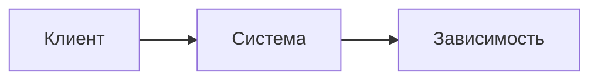

# Высокоуровневое описание архитектуры

## Обзор текущей архитектуры

<краткое описание текущего решения>

## Контекстная диаграмма

## Компоненты

### <название компонента>

- зона ответственности
- подтверждающие артефакты

## Основные потоки

1. <основной поток>

## Интеграции

1. <краткое описание интеграции>

## Риски и пробелы

1. <риск или пробел в документации>

## Примечания по достоверности

- <что подтверждено, а что выведено косвенно>
