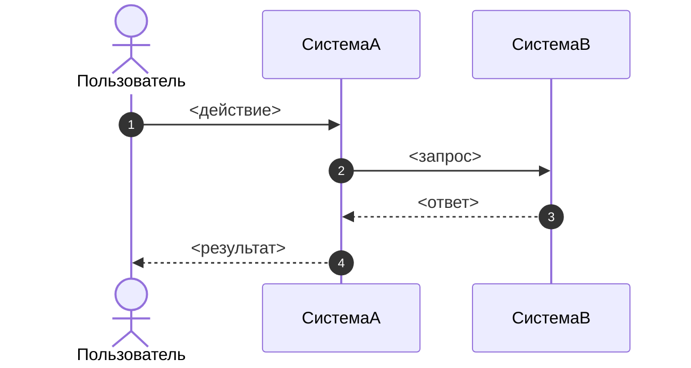

# Фича: <название фичи>

## Метаданные

- Идентификатор фичи: `FEAT-XXXX`
- Тип: `user-facing | machine-to-machine | operational`
- Статус: `текущее-состояние`
- Статус реализации: `implemented | partial | not-implemented | unknown`
- Владелец: `<владелец продукта или системы>`
- Аналитик: `<аналитик>`
- Связанные системы: `<список систем>`

## Бизнес-возможность

Кратко опиши, какую возможность уже реализует продукт.

## Пользовательская история или текущий сценарий

Как `<роль>`, я могу `<текущее действие или возможность>`, чтобы `<бизнес-результат>`.

## Текущее поведение

Опиши текущее фактическое поведение системы.

## Функциональные правила

1. <наблюдаемое правило>
2. <наблюдаемое правило>

## Нефункциональные характеристики

1. <наблюдаемая или выведенная характеристика>
2. <наблюдаемая или выведенная характеристика>

## Ограничения

1. <ограничение>
2. <ограничение>

## Основной поток

1. <шаг>
2. <шаг>

## Альтернативные потоки

### <название альтернативного потока>

- <условие и соответствующее поведение>

## Последовательность бизнес-процесса

## Трассировка реализации

### Точки входа

| Тип | Путь | Репозиторий |
| --- | --- | --- |
| `<endpoint / consumer / cron / cli / job>` | `<путь>` | `<repo-name>` |

### Ключевые файлы реализации

| Роль | Путь | Репозиторий |
| --- | --- | --- |
| `<use case / domain service / handler / repository>` | `<путь>` | `<repo-name>` |

### Подтверждающие тесты

| Тип | Путь | Что подтверждает |
| --- | --- | --- |
| `<integration / e2e / contract / unit>` | `<repo-name/path>` | `<кратко>` |

## Конфигурация и управление

### Переменные окружения и конфиги

| Ключ | Описание | Значение по умолчанию | Где задаётся |
| --- | --- | --- | --- |
| `<ENV_VAR>` | `<описание>` | `<default>` | `<service-name: .env / helm / vault / db>` |

### Feature flags

| Флаг | Описание | По умолчанию | Как включить |
| --- | --- | --- | --- |
| `<flag-name>` | `<описание>` | `<on / off>` | `<где и как>` |

## Примечания по достоверности

- <что подтверждено, а что выведено косвенно>
