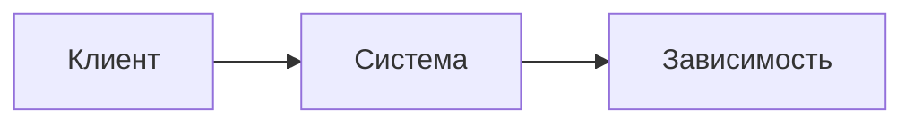

# Высокоуровневое описание решения

## Цель

<цель>

## Границы

- <элемент границ>

## Контекстная диаграмма

## Обзор решения

<общее описание решения>

## Компоненты

### <название компонента>

- <зона ответственности>

## Ключевые проектные решения

1. <решение>

## Риски

1. <риск>

<!-- Вопросы по HLD → open-questions.md, колонка «Контекст»: hld -->
