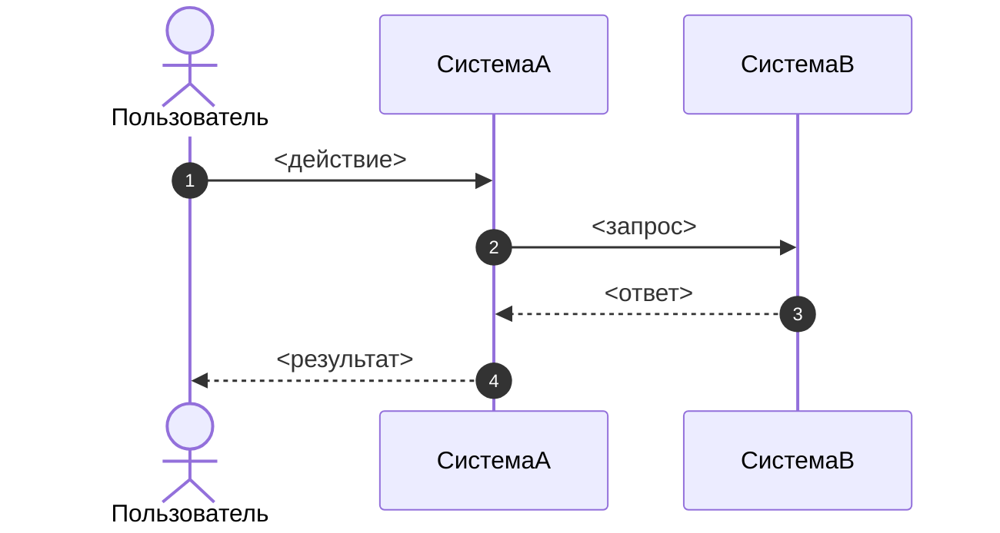

# Фича: <название фичи>

## Метаданные

- Идентификатор фичи: `FEAT-XXXX`
- Статус: `черновик`
- Владелец: `<владелец продукта>`
- Аналитик: `<аналитик>`
- Связанные системы: `<список систем>`

## Пользовательская история

Как `<роль>`, я хочу `<возможность>`, чтобы `<бизнес-ценность>`.

## Бизнес-контекст

Краткое описание проблемы, мотивации и ожидаемого бизнес-эффекта.

## Функциональные требования

1. <функциональное требование>
2. <функциональное требование>

## Нефункциональные требования

1. <нефункциональное требование>
2. <нефункциональное требование>

## Ограничения

1. <ограничение>
2. <ограничение>

## Основной поток

1. <шаг>
2. <шаг>

## Альтернативные потоки

### <название альтернативного потока>

- <условие и соответствующее поведение>

## Последовательность бизнес-процесса

## Примечания по приемке

- <заметка по приемке>
